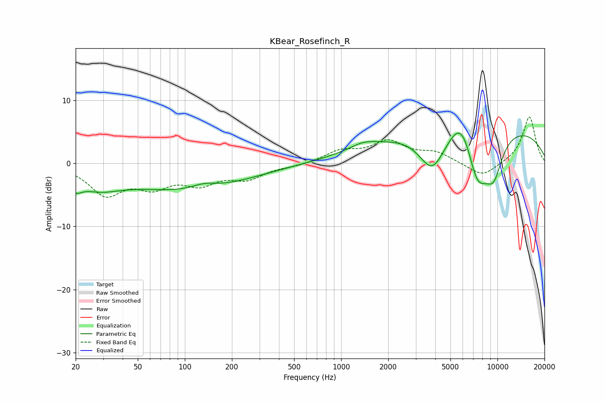

# KBear_Rosefinch_R
See [usage instructions](https://github.com/jaakkopasanen/AutoEq#usage) for more options and info.

### Parametric EQs
Apply preamp of -4.9 dB when using parametric equalizer.

|   # | Type    |   Fc (Hz) |    Q |   Gain (dB) |
|-----|---------|-----------|------|-------------|
|   1 | Peaking |        20 | 3.6  |        -1.8 |
|   2 | Peaking |        28 | 0.96 |        -2.7 |
|   3 | Peaking |       104 | 0.36 |        -4.1 |
|   4 | Peaking |       133 | 1.81 |         0.9 |
|   5 | Peaking |      1380 | 1.81 |         0.9 |
|   6 | Peaking |      3819 | 1.66 |        -6.2 |
|   7 | Peaking |      5914 | 1.78 |         5.4 |
|   8 | Peaking |      7438 | 1.7  |        -8.9 |
|   9 | Peaking |      7512 | 0.18 |         6.4 |
|  10 | Peaking |      9461 | 2.18 |        -5.7 |

### Fixed Band EQs
When using fixed band (also called graphic) equalizer, apply preamp of **-7.4 dB** (if available) and set gains manually with these parameters.

|   # | Type    |   Fc (Hz) |    Q |   Gain (dB) |
|-----|---------|-----------|------|-------------|
|   1 | Peaking |        31 | 1.41 |        -4.7 |
|   2 | Peaking |        62 | 1.41 |        -3.1 |
|   3 | Peaking |       125 | 1.41 |        -2.8 |
|   4 | Peaking |       250 | 1.41 |        -2.1 |
|   5 | Peaking |       500 | 1.41 |        -0.4 |
|   6 | Peaking |      1000 | 1.41 |         1.8 |
|   7 | Peaking |      2000 | 1.41 |         3.2 |
|   8 | Peaking |      4000 | 1.41 |         1.6 |
|   9 | Peaking |      8000 | 1.41 |        -2.3 |
|  10 | Peaking |     16000 | 1.41 |         7.5 |

### Graphs

