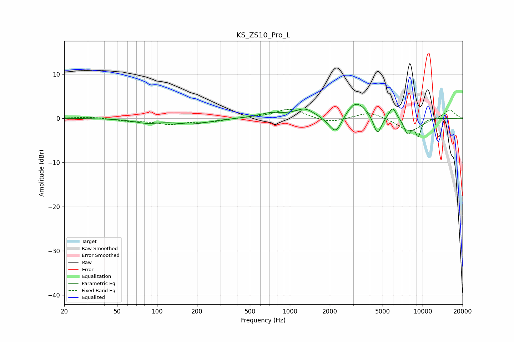

# KS_ZS10_Pro_L
See [usage instructions](https://github.com/jaakkopasanen/AutoEq#usage) for more options and info.

### Parametric EQs
Apply preamp of -3.3 dB when using parametric equalizer.

|   # | Type    |   Fc (Hz) |    Q |   Gain (dB) |
|-----|---------|-----------|------|-------------|
|   1 | Peaking |        83 | 1.5  |        -0.9 |
|   2 | Peaking |       184 | 1.09 |        -1.2 |
|   3 | Peaking |       724 | 1.5  |         1.1 |
|   4 | Peaking |      1299 | 1.99 |         2   |
|   5 | Peaking |      2215 | 2.7  |        -4.6 |
|   6 | Peaking |      3133 | 1.71 |         4.3 |
|   7 | Peaking |      4568 | 4.56 |        -4.5 |
|   8 | Peaking |      5943 | 4.98 |         2.7 |
|   9 | Peaking |      7716 | 4.59 |        -3.5 |
|  10 | Peaking |      9265 | 5.78 |        -3.7 |

### Fixed Band EQs
When using fixed band (also called graphic) equalizer, apply preamp of **-2.1 dB** (if available) and set gains manually with these parameters.

|   # | Type    |   Fc (Hz) |    Q |   Gain (dB) |
|-----|---------|-----------|------|-------------|
|   1 | Peaking |        31 | 1.41 |         0.3 |
|   2 | Peaking |        62 | 1.41 |        -0.6 |
|   3 | Peaking |       125 | 1.41 |        -1.2 |
|   4 | Peaking |       250 | 1.41 |        -0.7 |
|   5 | Peaking |       500 | 1.41 |         0.2 |
|   6 | Peaking |      1000 | 1.41 |         2.2 |
|   7 | Peaking |      2000 | 1.41 |        -1.1 |
|   8 | Peaking |      4000 | 1.41 |         1.6 |
|   9 | Peaking |      8000 | 1.41 |        -3.1 |
|  10 | Peaking |     16000 | 1.41 |         2   |

### Graphs

