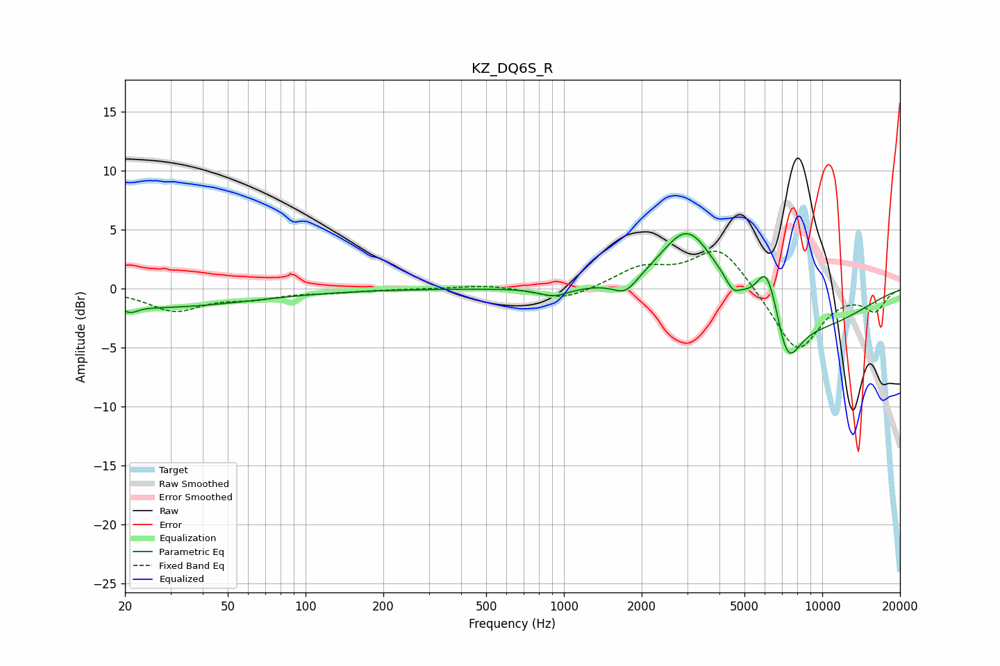

# KZ_DQ6S_R
See [usage instructions](https://github.com/jaakkopasanen/AutoEq#usage) for more options and info.

### Parametric EQs
Apply preamp of -4.8 dB when using parametric equalizer.

|   # | Type    |   Fc (Hz) |    Q |   Gain (dB) |
|-----|---------|-----------|------|-------------|
|   1 | Peaking |        21 | 5.59 |        -0.5 |
|   2 | Peaking |        25 | 0.36 |        -1.6 |
|   3 | Peaking |       914 | 2.41 |        -0.8 |
|   4 | Peaking |      1730 | 2.95 |        -1.3 |
|   5 | Peaking |      3017 | 1.34 |         5.7 |
|   6 | Peaking |      4506 | 5.59 |        -0.9 |
|   7 | Peaking |      6046 | 3.65 |         3.5 |
|   8 | Peaking |      6557 | 3.65 |         1.4 |
|   9 | Peaking |      7278 | 2.64 |        -4.5 |
|  10 | Peaking |      8859 | 0.52 |        -3.2 |

### Fixed Band EQs
When using fixed band (also called graphic) equalizer, apply preamp of **-3.3 dB** (if available) and set gains manually with these parameters.

|   # | Type    |   Fc (Hz) |    Q |   Gain (dB) |
|-----|---------|-----------|------|-------------|
|   1 | Peaking |        31 | 1.41 |        -1.8 |
|   2 | Peaking |        62 | 1.41 |        -0.7 |
|   3 | Peaking |       125 | 1.41 |        -0.2 |
|   4 | Peaking |       250 | 1.41 |        -0   |
|   5 | Peaking |       500 | 1.41 |         0.3 |
|   6 | Peaking |      1000 | 1.41 |        -1.1 |
|   7 | Peaking |      2000 | 1.41 |         1.7 |
|   8 | Peaking |      4000 | 1.41 |         3.7 |
|   9 | Peaking |      8000 | 1.41 |        -5.4 |
|  10 | Peaking |     16000 | 1.41 |        -1.8 |

### Graphs

