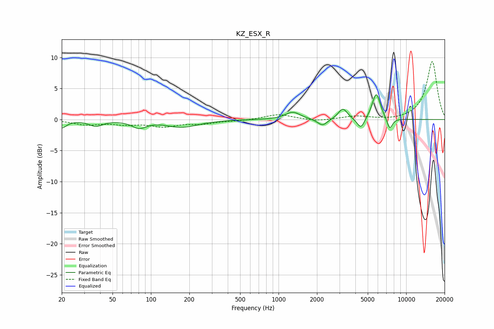

# KZ_ESX_R
See [usage instructions](https://github.com/jaakkopasanen/AutoEq#usage) for more options and info.

### Parametric EQs
Apply preamp of -4.1 dB when using parametric equalizer.

|   # | Type    |   Fc (Hz) |    Q |   Gain (dB) |
|-----|---------|-----------|------|-------------|
|   1 | Peaking |        20 | 3.79 |        -1.3 |
|   2 | Peaking |        37 | 2.72 |        -1   |
|   3 | Peaking |        81 | 2.56 |        -1.2 |
|   4 | Peaking |       176 | 1.13 |        -1.2 |
|   5 | Peaking |      1291 | 2.43 |         1.2 |
|   6 | Peaking |      2208 | 3.69 |        -1.1 |
|   7 | Peaking |      3190 | 3.99 |         1.8 |
|   8 | Peaking |      4416 | 4.65 |        -1.8 |
|   9 | Peaking |      5827 | 4.25 |         4.3 |
|  10 | Peaking |      7438 | 6    |        -1.9 |

### Fixed Band EQs
When using fixed band (also called graphic) equalizer, apply preamp of **-9.4 dB** (if available) and set gains manually with these parameters.

|   # | Type    |   Fc (Hz) |    Q |   Gain (dB) |
|-----|---------|-----------|------|-------------|
|   1 | Peaking |        31 | 1.41 |        -0.8 |
|   2 | Peaking |        62 | 1.41 |        -0.6 |
|   3 | Peaking |       125 | 1.41 |        -1   |
|   4 | Peaking |       250 | 1.41 |        -0.6 |
|   5 | Peaking |       500 | 1.41 |        -0.2 |
|   6 | Peaking |      1000 | 1.41 |         0.9 |
|   7 | Peaking |      2000 | 1.41 |        -0.3 |
|   8 | Peaking |      4000 | 1.41 |         0.5 |
|   9 | Peaking |      8000 | 1.41 |        -0.2 |
|  10 | Peaking |     16000 | 1.41 |         9.4 |

### Graphs

