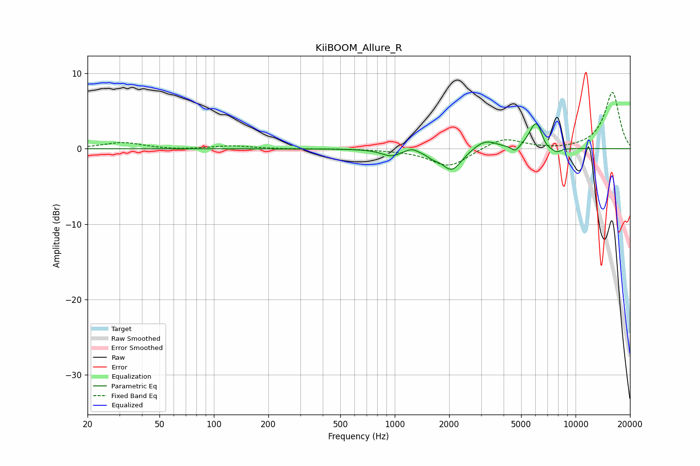

# KiiBOOM_Allure_R
See [usage instructions](https://github.com/jaakkopasanen/AutoEq#usage) for more options and info.

### Parametric EQs
Apply preamp of -3.4 dB when using parametric equalizer.

|   # | Type    |   Fc (Hz) |    Q |   Gain (dB) |
|-----|---------|-----------|------|-------------|
|   1 | Peaking |       952 | 2.74 |        -0.9 |
|   2 | Peaking |      1239 | 4.43 |         0.5 |
|   3 | Peaking |      1625 | 4.22 |        -0.5 |
|   4 | Peaking |      2072 | 2.57 |        -2.9 |
|   5 | Peaking |      3165 | 2.23 |         1.3 |
|   6 | Peaking |      4645 | 6    |        -0.8 |
|   7 | Peaking |      5969 | 3.68 |         3.2 |
|   8 | Peaking |      6253 | 5.99 |         1   |
|   9 | Peaking |      6673 | 2.81 |        -0.9 |
|  10 | Peaking |      7873 | 5.57 |        -0.5 |

### Fixed Band EQs
When using fixed band (also called graphic) equalizer, apply preamp of **-7.6 dB** (if available) and set gains manually with these parameters.

|   # | Type    |   Fc (Hz) |    Q |   Gain (dB) |
|-----|---------|-----------|------|-------------|
|   1 | Peaking |        31 | 1.41 |         0.8 |
|   2 | Peaking |        62 | 1.41 |        -0.2 |
|   3 | Peaking |       125 | 1.41 |         0.4 |
|   4 | Peaking |       250 | 1.41 |        -0   |
|   5 | Peaking |       500 | 1.41 |         0   |
|   6 | Peaking |      1000 | 1.41 |        -0.1 |
|   7 | Peaking |      2000 | 1.41 |        -2.4 |
|   8 | Peaking |      4000 | 1.41 |         1.5 |
|   9 | Peaking |      8000 | 1.41 |        -0.2 |
|  10 | Peaking |     16000 | 1.41 |         7.5 |

### Graphs

