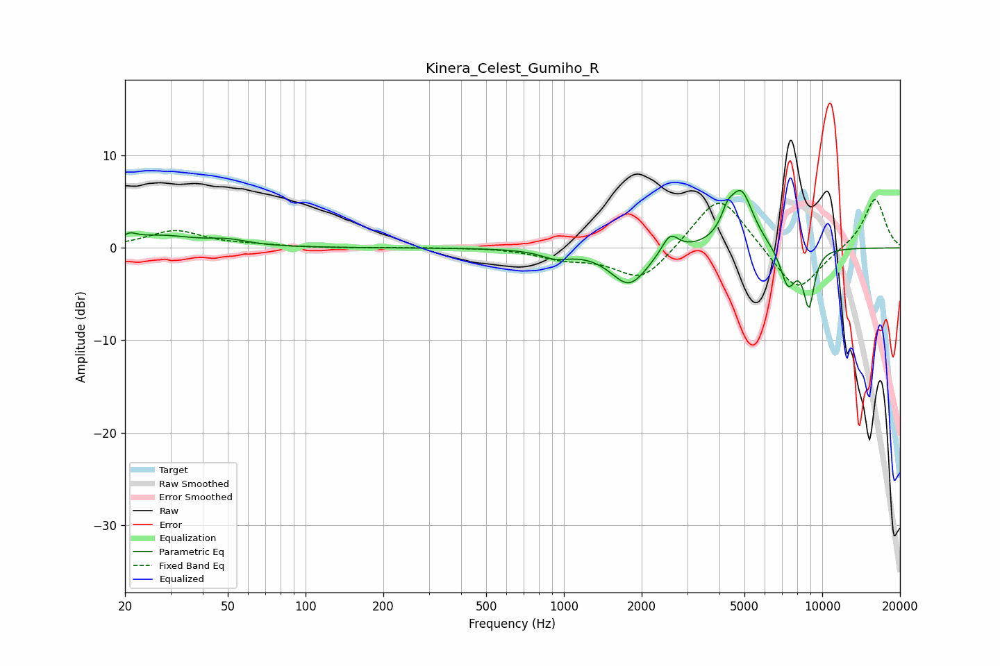

# Kinera_Celest_Gumiho_R
See [usage instructions](https://github.com/jaakkopasanen/AutoEq#usage) for more options and info.

### Parametric EQs
Apply preamp of -6.3 dB when using parametric equalizer.

|   # | Type    |   Fc (Hz) |    Q |   Gain (dB) |
|-----|---------|-----------|------|-------------|
|   1 | Peaking |        21 | 5.75 |         0.6 |
|   2 | Peaking |        27 | 1.04 |         1.3 |
|   3 | Peaking |        50 | 1.86 |         0.6 |
|   4 | Peaking |       929 | 2.52 |        -0.8 |
|   5 | Peaking |      1789 | 1.98 |        -4   |
|   6 | Peaking |      2576 | 4.32 |         2.1 |
|   7 | Peaking |      4295 | 5.98 |         1.6 |
|   8 | Peaking |      4856 | 2.92 |         6.1 |
|   9 | Peaking |      7374 | 4.36 |        -4.1 |
|  10 | Peaking |      8883 | 6    |        -6   |

### Fixed Band EQs
When using fixed band (also called graphic) equalizer, apply preamp of **-5.3 dB** (if available) and set gains manually with these parameters.

|   # | Type    |   Fc (Hz) |    Q |   Gain (dB) |
|-----|---------|-----------|------|-------------|
|   1 | Peaking |        31 | 1.41 |         1.8 |
|   2 | Peaking |        62 | 1.41 |         0.2 |
|   3 | Peaking |       125 | 1.41 |        -0   |
|   4 | Peaking |       250 | 1.41 |         0.1 |
|   5 | Peaking |       500 | 1.41 |         0.1 |
|   6 | Peaking |      1000 | 1.41 |        -1   |
|   7 | Peaking |      2000 | 1.41 |        -3.7 |
|   8 | Peaking |      4000 | 1.41 |         6.2 |
|   9 | Peaking |      8000 | 1.41 |        -5.1 |
|  10 | Peaking |     16000 | 1.41 |         5.5 |

### Graphs

