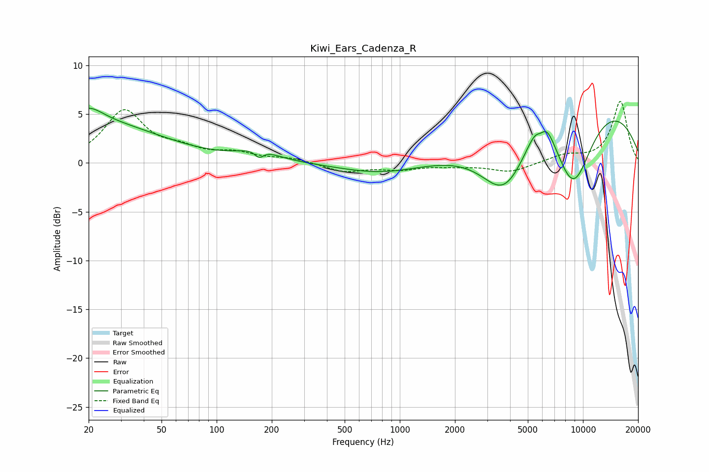

# Kiwi_Ears_Cadenza_R
See [usage instructions](https://github.com/jaakkopasanen/AutoEq#usage) for more options and info.

### Parametric EQs
Apply preamp of -5.7 dB when using parametric equalizer.

|   # | Type    |   Fc (Hz) |    Q |   Gain (dB) |
|-----|---------|-----------|------|-------------|
|   1 | Peaking |        20 | 1.85 |         1.5 |
|   2 | Peaking |        21 | 0.37 |         4.1 |
|   3 | Peaking |       168 | 1.42 |         1.1 |
|   4 | Peaking |       170 | 5.6  |        -0.8 |
|   5 | Peaking |       791 | 0.65 |        -1.1 |
|   6 | Peaking |      3724 | 1.09 |        -6   |
|   7 | Peaking |      5895 | 4.3  |        -2.2 |
|   8 | Peaking |      5947 | 2.32 |         5.5 |
|   9 | Peaking |      8847 | 1.16 |        -8.5 |
|  10 | Peaking |      9807 | 0.27 |         7   |

### Fixed Band EQs
When using fixed band (also called graphic) equalizer, apply preamp of **-6.4 dB** (if available) and set gains manually with these parameters.

|   # | Type    |   Fc (Hz) |    Q |   Gain (dB) |
|-----|---------|-----------|------|-------------|
|   1 | Peaking |        31 | 1.41 |         5.2 |
|   2 | Peaking |        62 | 1.41 |         1.1 |
|   3 | Peaking |       125 | 1.41 |         0.9 |
|   4 | Peaking |       250 | 1.41 |         0.4 |
|   5 | Peaking |       500 | 1.41 |        -0.9 |
|   6 | Peaking |      1000 | 1.41 |        -0.6 |
|   7 | Peaking |      2000 | 1.41 |        -0.3 |
|   8 | Peaking |      4000 | 1.41 |        -0.9 |
|   9 | Peaking |      8000 | 1.41 |         0.7 |
|  10 | Peaking |     16000 | 1.41 |         6.3 |

### Graphs

