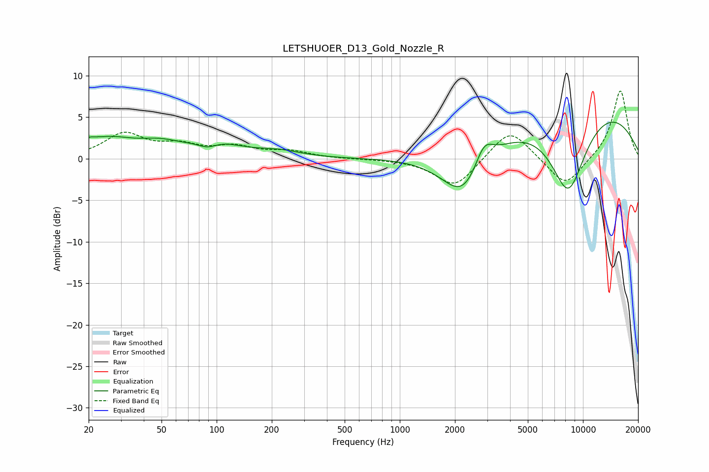

# LETSHUOER_D13_Gold_Nozzle_R
See [usage instructions](https://github.com/jaakkopasanen/AutoEq#usage) for more options and info.

### Parametric EQs
Apply preamp of -4.5 dB when using parametric equalizer.

|   # | Type    |   Fc (Hz) |    Q |   Gain (dB) |
|-----|---------|-----------|------|-------------|
|   1 | Peaking |        20 | 5.11 |         0.4 |
|   2 | Peaking |        25 | 0.92 |         2.2 |
|   3 | Peaking |        49 | 1.29 |         1.1 |
|   4 | Peaking |        89 | 2.5  |        -1   |
|   5 | Peaking |        97 | 1.03 |         1.8 |
|   6 | Peaking |       219 | 1.16 |         0.7 |
|   7 | Peaking |      2243 | 1.15 |        -6.4 |
|   8 | Peaking |      2875 | 2.76 |         3.1 |
|   9 | Peaking |      8309 | 1.2  |       -11   |
|  10 | Peaking |      9246 | 0.29 |         7.8 |

### Fixed Band EQs
When using fixed band (also called graphic) equalizer, apply preamp of **-8.3 dB** (if available) and set gains manually with these parameters.

|   # | Type    |   Fc (Hz) |    Q |   Gain (dB) |
|-----|---------|-----------|------|-------------|
|   1 | Peaking |        31 | 1.41 |         2.9 |
|   2 | Peaking |        62 | 1.41 |         1.4 |
|   3 | Peaking |       125 | 1.41 |         1.3 |
|   4 | Peaking |       250 | 1.41 |         0.8 |
|   5 | Peaking |       500 | 1.41 |        -0   |
|   6 | Peaking |      1000 | 1.41 |        -0   |
|   7 | Peaking |      2000 | 1.41 |        -3.5 |
|   8 | Peaking |      4000 | 1.41 |         3.8 |
|   9 | Peaking |      8000 | 1.41 |        -3.5 |
|  10 | Peaking |     16000 | 1.41 |         8.4 |

### Graphs

