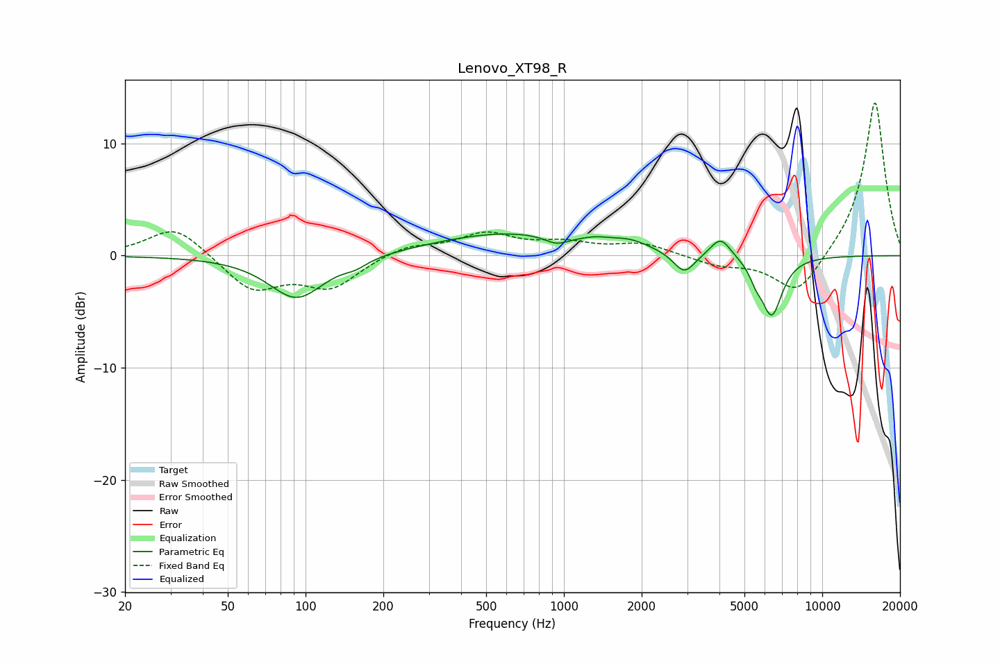

# Lenovo_XT98_R
See [usage instructions](https://github.com/jaakkopasanen/AutoEq#usage) for more options and info.

### Parametric EQs
Apply preamp of -2.0 dB when using parametric equalizer.

|   # | Type    |   Fc (Hz) |    Q |   Gain (dB) |
|-----|---------|-----------|------|-------------|
|   1 | Peaking |        92 | 1.32 |        -3.9 |
|   2 | Peaking |       156 | 3.18 |        -0.5 |
|   3 | Peaking |       607 | 0.49 |         2   |
|   4 | Peaking |       937 | 3.14 |        -0.7 |
|   5 | Peaking |      1323 | 2.61 |         0.3 |
|   6 | Peaking |      1800 | 1.79 |         0.8 |
|   7 | Peaking |      2923 | 3.43 |        -1.9 |
|   8 | Peaking |      4044 | 3.56 |         1.8 |
|   9 | Peaking |      5534 | 6    |        -0.9 |
|  10 | Peaking |      6370 | 3.33 |        -5.3 |

### Fixed Band EQs
When using fixed band (also called graphic) equalizer, apply preamp of **-13.7 dB** (if available) and set gains manually with these parameters.

|   # | Type    |   Fc (Hz) |    Q |   Gain (dB) |
|-----|---------|-----------|------|-------------|
|   1 | Peaking |        31 | 1.41 |         2.7 |
|   2 | Peaking |        62 | 1.41 |        -3.1 |
|   3 | Peaking |       125 | 1.41 |        -2.7 |
|   4 | Peaking |       250 | 1.41 |         0.9 |
|   5 | Peaking |       500 | 1.41 |         1.8 |
|   6 | Peaking |      1000 | 1.41 |         1   |
|   7 | Peaking |      2000 | 1.41 |         1   |
|   8 | Peaking |      4000 | 1.41 |        -0.8 |
|   9 | Peaking |      8000 | 1.41 |        -3.7 |
|  10 | Peaking |     16000 | 1.41 |        13.9 |

### Graphs

