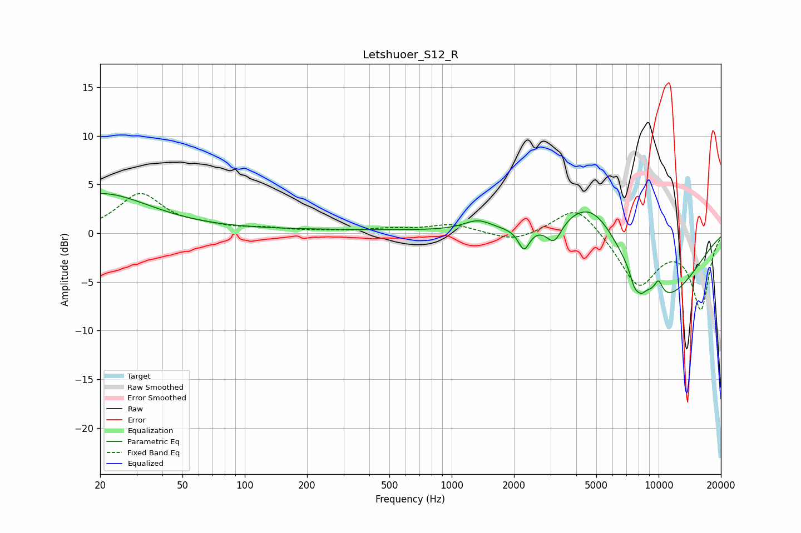

# Letshuoer_S12_R
See [usage instructions](https://github.com/jaakkopasanen/AutoEq#usage) for more options and info.

### Parametric EQs
Apply preamp of -4.2 dB when using parametric equalizer.

|   # | Type    |   Fc (Hz) |    Q |   Gain (dB) |
|-----|---------|-----------|------|-------------|
|   1 | Peaking |        20 | 0.6  |         4   |
|   2 | Peaking |       217 | 0.2  |         0.3 |
|   3 | Peaking |      1338 | 2.06 |         1.1 |
|   4 | Peaking |      2236 | 5.22 |        -2.2 |
|   5 | Peaking |      3126 | 3.87 |        -2.1 |
|   6 | Peaking |      4776 | 0.97 |         5.4 |
|   7 | Peaking |      7644 | 6    |        -1.4 |
|   8 | Peaking |      8232 | 5.97 |        -1   |
|   9 | Peaking |      9983 | 6    |         1.5 |
|  10 | Peaking |     10000 | 0.56 |        -7.4 |

### Fixed Band EQs
When using fixed band (also called graphic) equalizer, apply preamp of **-4.2 dB** (if available) and set gains manually with these parameters.

|   # | Type    |   Fc (Hz) |    Q |   Gain (dB) |
|-----|---------|-----------|------|-------------|
|   1 | Peaking |        31 | 1.41 |         4   |
|   2 | Peaking |        62 | 1.41 |         0.5 |
|   3 | Peaking |       125 | 1.41 |         0.4 |
|   4 | Peaking |       250 | 1.41 |         0.2 |
|   5 | Peaking |       500 | 1.41 |         0.4 |
|   6 | Peaking |      1000 | 1.41 |         0.9 |
|   7 | Peaking |      2000 | 1.41 |        -0.9 |
|   8 | Peaking |      4000 | 1.41 |         3.1 |
|   9 | Peaking |      8000 | 1.41 |        -5.3 |
|  10 | Peaking |     16000 | 1.41 |        -7.7 |

### Graphs

