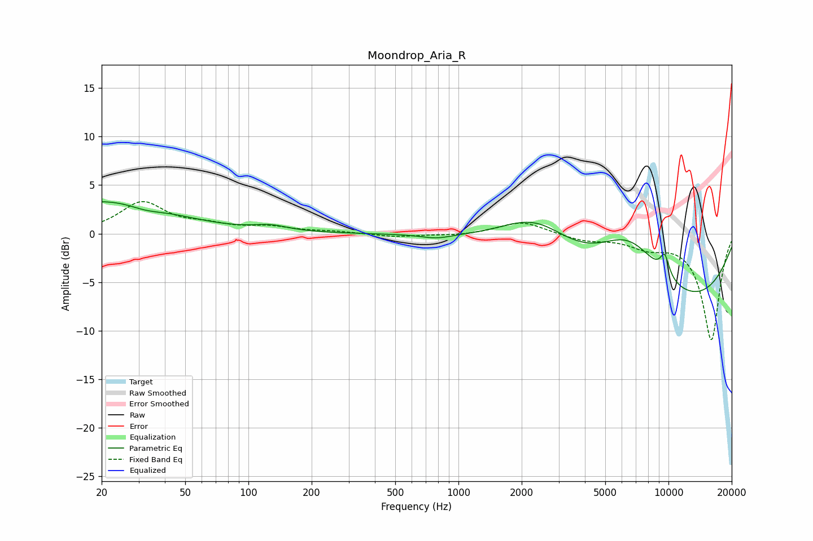

# Moondrop_Aria_R
See [usage instructions](https://github.com/jaakkopasanen/AutoEq#usage) for more options and info.

### Parametric EQs
Apply preamp of -3.4 dB when using parametric equalizer.

|   # | Type    |   Fc (Hz) |    Q |   Gain (dB) |
|-----|---------|-----------|------|-------------|
|   1 | Peaking |        22 | 0.49 |         3.4 |
|   2 | Peaking |        33 | 1.5  |        -0.9 |
|   3 | Peaking |        35 | 1.17 |         0.3 |
|   4 | Peaking |       128 | 1.74 |         0.5 |
|   5 | Peaking |       786 | 2.01 |        -0.4 |
|   6 | Peaking |      2347 | 0.78 |         4.6 |
|   7 | Peaking |      6492 | 0.77 |         7.3 |
|   8 | Peaking |      7356 | 0.34 |        -1.7 |
|   9 | Peaking |      8518 | 0.23 |        -7.5 |
|  10 | Peaking |      9599 | 5.65 |         2.2 |

### Fixed Band EQs
When using fixed band (also called graphic) equalizer, apply preamp of **-3.4 dB** (if available) and set gains manually with these parameters.

|   # | Type    |   Fc (Hz) |    Q |   Gain (dB) |
|-----|---------|-----------|------|-------------|
|   1 | Peaking |        31 | 1.41 |         3.1 |
|   2 | Peaking |        62 | 1.41 |         0.7 |
|   3 | Peaking |       125 | 1.41 |         0.6 |
|   4 | Peaking |       250 | 1.41 |         0.2 |
|   5 | Peaking |       500 | 1.41 |        -0.3 |
|   6 | Peaking |      1000 | 1.41 |        -0.2 |
|   7 | Peaking |      2000 | 1.41 |         1.3 |
|   8 | Peaking |      4000 | 1.41 |        -0.7 |
|   9 | Peaking |      8000 | 1.41 |        -1.2 |
|  10 | Peaking |     16000 | 1.41 |       -10.9 |

### Graphs

