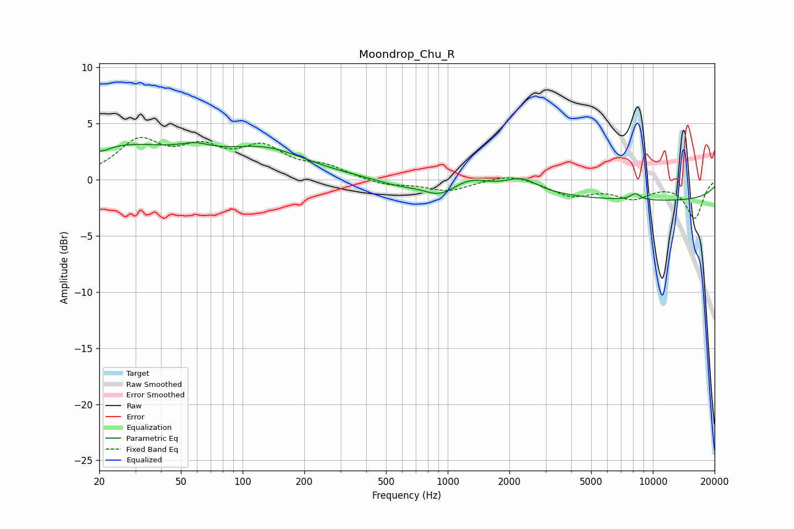

# Moondrop_Chu_R
See [usage instructions](https://github.com/jaakkopasanen/AutoEq#usage) for more options and info.

### Parametric EQs
Apply preamp of -3.4 dB when using parametric equalizer.

|   # | Type    |   Fc (Hz) |    Q |   Gain (dB) |
|-----|---------|-----------|------|-------------|
|   1 | Peaking |        20 | 2.78 |        -0.6 |
|   2 | Peaking |        24 | 0.42 |         3   |
|   3 | Peaking |        59 | 1.98 |         0.6 |
|   4 | Peaking |       130 | 0.69 |         2.3 |
|   5 | Peaking |       561 | 1.35 |        -0.5 |
|   6 | Peaking |       921 | 1.64 |        -1.3 |
|   7 | Peaking |      1258 | 1.68 |         0.8 |
|   8 | Peaking |      2310 | 1.97 |         1   |
|   9 | Peaking |      8216 | 5.21 |         0.6 |
|  10 | Peaking |     10000 | 0.18 |        -1.9 |

### Fixed Band EQs
When using fixed band (also called graphic) equalizer, apply preamp of **-3.8 dB** (if available) and set gains manually with these parameters.

|   # | Type    |   Fc (Hz) |    Q |   Gain (dB) |
|-----|---------|-----------|------|-------------|
|   1 | Peaking |        31 | 1.41 |         3.2 |
|   2 | Peaking |        62 | 1.41 |         2.3 |
|   3 | Peaking |       125 | 1.41 |         2.5 |
|   4 | Peaking |       250 | 1.41 |         1   |
|   5 | Peaking |       500 | 1.41 |        -0.5 |
|   6 | Peaking |      1000 | 1.41 |        -1   |
|   7 | Peaking |      2000 | 1.41 |         0.6 |
|   8 | Peaking |      4000 | 1.41 |        -1.3 |
|   9 | Peaking |      8000 | 1.41 |        -1.4 |
|  10 | Peaking |     16000 | 1.41 |        -3.4 |

### Graphs

