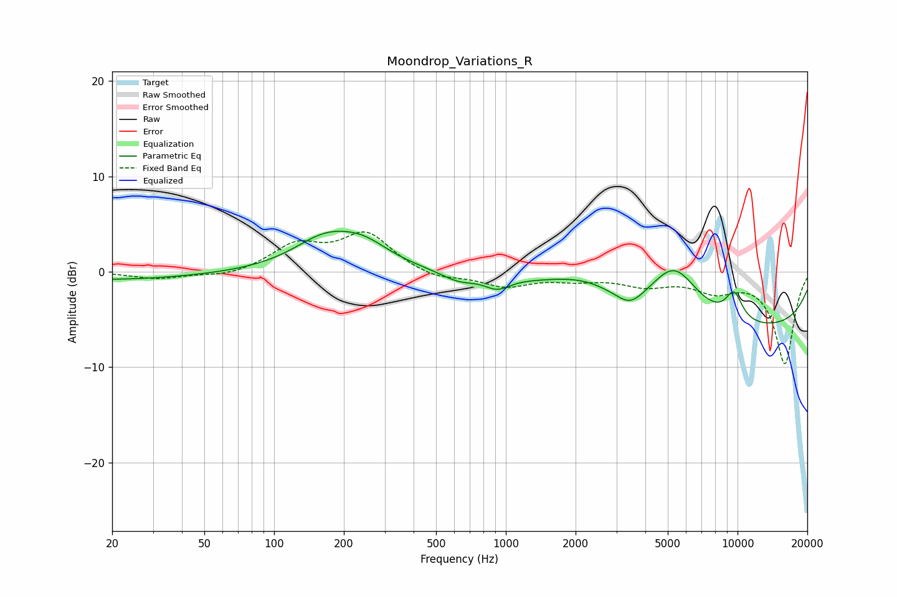

# Moondrop_Variations_R
See [usage instructions](https://github.com/jaakkopasanen/AutoEq#usage) for more options and info.

### Parametric EQs
Apply preamp of -4.3 dB when using parametric equalizer.

|   # | Type    |   Fc (Hz) |    Q |   Gain (dB) |
|-----|---------|-----------|------|-------------|
|   1 | Peaking |        20 | 0.37 |        -0.8 |
|   2 | Peaking |       166 | 1.03 |         3.1 |
|   3 | Peaking |       244 | 1.22 |         2.1 |
|   4 | Peaking |       624 | 1.9  |        -0.9 |
|   5 | Peaking |       918 | 2.56 |        -1.2 |
|   6 | Peaking |      2186 | 0.89 |         2   |
|   7 | Peaking |      3432 | 2.33 |        -1.5 |
|   8 | Peaking |      5333 | 1.31 |         5.5 |
|   9 | Peaking |      9479 | 0.18 |        -6.2 |
|  10 | Peaking |      9653 | 3.33 |         2.9 |

### Fixed Band EQs
When using fixed band (also called graphic) equalizer, apply preamp of **-4.3 dB** (if available) and set gains manually with these parameters.

|   # | Type    |   Fc (Hz) |    Q |   Gain (dB) |
|-----|---------|-----------|------|-------------|
|   1 | Peaking |        31 | 1.41 |        -0.7 |
|   2 | Peaking |        62 | 1.41 |        -0.5 |
|   3 | Peaking |       125 | 1.41 |         2.6 |
|   4 | Peaking |       250 | 1.41 |         3.9 |
|   5 | Peaking |       500 | 1.41 |        -0.8 |
|   6 | Peaking |      1000 | 1.41 |        -1.5 |
|   7 | Peaking |      2000 | 1.41 |        -0.7 |
|   8 | Peaking |      4000 | 1.41 |        -1.3 |
|   9 | Peaking |      8000 | 1.41 |        -1.7 |
|  10 | Peaking |     16000 | 1.41 |        -9.6 |

### Graphs

