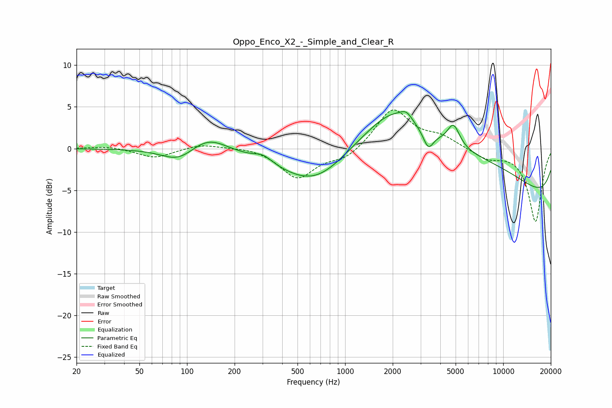

# Oppo_Enco_X2_-_Simple_and_Clear_R
See [usage instructions](https://github.com/jaakkopasanen/AutoEq#usage) for more options and info.

### Parametric EQs
Apply preamp of -4.5 dB when using parametric equalizer.

|   # | Type    |   Fc (Hz) |    Q |   Gain (dB) |
|-----|---------|-----------|------|-------------|
|   1 | Peaking |        89 | 1.31 |        -1.7 |
|   2 | Peaking |       135 | 1.18 |         1.9 |
|   3 | Peaking |       303 | 2.4  |         0.9 |
|   4 | Peaking |       669 | 0.59 |        -6.3 |
|   5 | Peaking |      2009 | 1.04 |         2.6 |
|   6 | Peaking |      2443 | 3.62 |         1   |
|   7 | Peaking |      3359 | 4.48 |        -2   |
|   8 | Peaking |      3863 | 0.18 |         7.7 |
|   9 | Peaking |      4851 | 3.6  |         2.6 |
|  10 | Peaking |     10000 | 0.18 |        -8.5 |

### Fixed Band EQs
When using fixed band (also called graphic) equalizer, apply preamp of **-4.7 dB** (if available) and set gains manually with these parameters.

|   # | Type    |   Fc (Hz) |    Q |   Gain (dB) |
|-----|---------|-----------|------|-------------|
|   1 | Peaking |        31 | 1.41 |         0.3 |
|   2 | Peaking |        62 | 1.41 |        -1.1 |
|   3 | Peaking |       125 | 1.41 |         0.6 |
|   4 | Peaking |       250 | 1.41 |         0.2 |
|   5 | Peaking |       500 | 1.41 |        -3.5 |
|   6 | Peaking |      1000 | 1.41 |        -1.3 |
|   7 | Peaking |      2000 | 1.41 |         4.8 |
|   8 | Peaking |      4000 | 1.41 |         1.3 |
|   9 | Peaking |      8000 | 1.41 |        -1.1 |
|  10 | Peaking |     16000 | 1.41 |        -8.7 |

### Graphs

