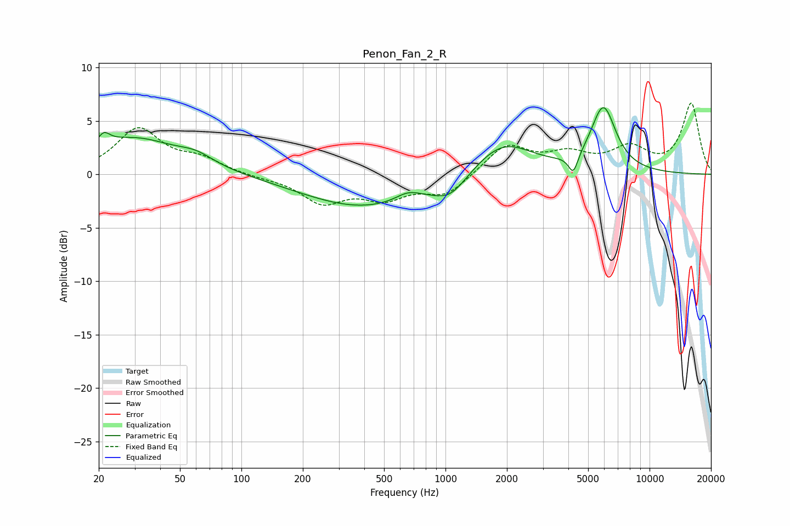

# Penon_Fan_2_R
See [usage instructions](https://github.com/jaakkopasanen/AutoEq#usage) for more options and info.

### Parametric EQs
Apply preamp of -6.3 dB when using parametric equalizer.

|   # | Type    |   Fc (Hz) |    Q |   Gain (dB) |
|-----|---------|-----------|------|-------------|
|   1 | Peaking |        21 | 5.61 |         3.4 |
|   2 | Peaking |        21 | 5.99 |        -2.4 |
|   3 | Peaking |        29 | 0.64 |         3.3 |
|   4 | Peaking |        60 | 1.69 |         0.8 |
|   5 | Peaking |       400 | 0.47 |        -3.1 |
|   6 | Peaking |       656 | 2.38 |         0.7 |
|   7 | Peaking |      1054 | 1.68 |        -1.8 |
|   8 | Peaking |      1902 | 0.96 |         3.2 |
|   9 | Peaking |      4230 | 5.99 |        -1.8 |
|  10 | Peaking |      5939 | 2.26 |         6   |

### Fixed Band EQs
When using fixed band (also called graphic) equalizer, apply preamp of **-6.7 dB** (if available) and set gains manually with these parameters.

|   # | Type    |   Fc (Hz) |    Q |   Gain (dB) |
|-----|---------|-----------|------|-------------|
|   1 | Peaking |        31 | 1.41 |         4.2 |
|   2 | Peaking |        62 | 1.41 |         1.3 |
|   3 | Peaking |       125 | 1.41 |        -0.2 |
|   4 | Peaking |       250 | 1.41 |        -2.5 |
|   5 | Peaking |       500 | 1.41 |        -2   |
|   6 | Peaking |      1000 | 1.41 |        -1.9 |
|   7 | Peaking |      2000 | 1.41 |         2.7 |
|   8 | Peaking |      4000 | 1.41 |         1.6 |
|   9 | Peaking |      8000 | 1.41 |         2.2 |
|  10 | Peaking |     16000 | 1.41 |         6.6 |

### Graphs

