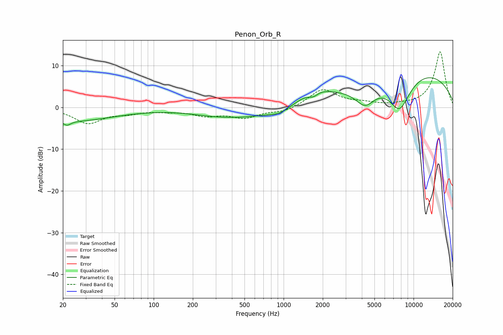

# Penon_Orb_R
See [usage instructions](https://github.com/jaakkopasanen/AutoEq#usage) for more options and info.

### Parametric EQs
Apply preamp of -7.2 dB when using parametric equalizer.

|   # | Type    |   Fc (Hz) |    Q |   Gain (dB) |
|-----|---------|-----------|------|-------------|
|   1 | Peaking |        22 | 5.46 |        -1   |
|   2 | Peaking |        22 | 0.41 |        -3.3 |
|   3 | Peaking |       272 | 0.8  |        -0.4 |
|   4 | Peaking |       508 | 0.48 |        -2.3 |
|   5 | Peaking |       941 | 1.93 |        -1.2 |
|   6 | Peaking |      1690 | 3.65 |        -1.4 |
|   7 | Peaking |      1707 | 1.15 |         3   |
|   8 | Peaking |      4235 | 1.77 |        -4.8 |
|   9 | Peaking |      7790 | 1.54 |        -8.4 |
|  10 | Peaking |      9715 | 0.26 |         9   |

### Fixed Band EQs
When using fixed band (also called graphic) equalizer, apply preamp of **-13.4 dB** (if available) and set gains manually with these parameters.

|   # | Type    |   Fc (Hz) |    Q |   Gain (dB) |
|-----|---------|-----------|------|-------------|
|   1 | Peaking |        31 | 1.41 |        -3.7 |
|   2 | Peaking |        62 | 1.41 |        -1.1 |
|   3 | Peaking |       125 | 1.41 |        -0.6 |
|   4 | Peaking |       250 | 1.41 |        -1.7 |
|   5 | Peaking |       500 | 1.41 |        -2.3 |
|   6 | Peaking |      1000 | 1.41 |        -1.1 |
|   7 | Peaking |      2000 | 1.41 |         4.3 |
|   8 | Peaking |      4000 | 1.41 |         0.8 |
|   9 | Peaking |      8000 | 1.41 |         0.3 |
|  10 | Peaking |     16000 | 1.41 |        13.4 |

### Graphs

