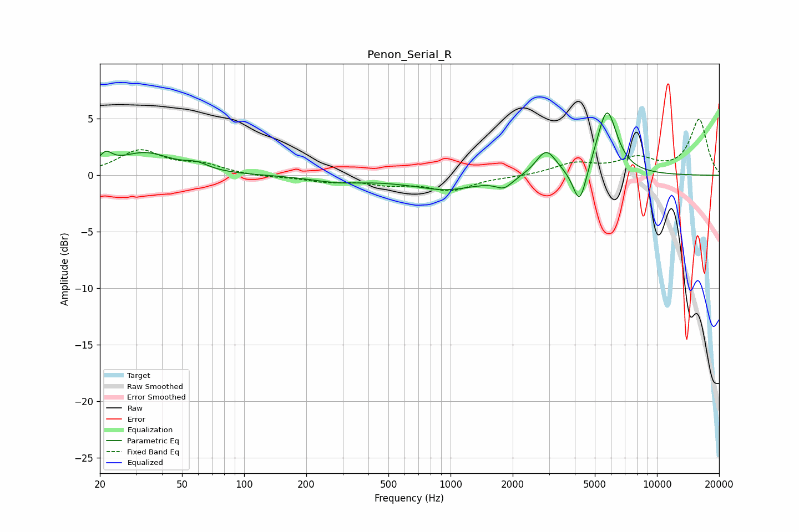

# Penon_Serial_R
See [usage instructions](https://github.com/jaakkopasanen/AutoEq#usage) for more options and info.

### Parametric EQs
Apply preamp of -5.6 dB when using parametric equalizer.

|   # | Type    |   Fc (Hz) |    Q |   Gain (dB) |
|-----|---------|-----------|------|-------------|
|   1 | Peaking |        21 | 4.52 |         1.1 |
|   2 | Peaking |        33 | 1.09 |         1.9 |
|   3 | Peaking |        59 | 2.52 |         0.6 |
|   4 | Peaking |       285 | 1.09 |        -0.5 |
|   5 | Peaking |       748 | 1.2  |         0.3 |
|   6 | Peaking |       897 | 0.83 |        -1.5 |
|   7 | Peaking |      1819 | 3.48 |        -0.9 |
|   8 | Peaking |      2905 | 2.85 |         2.3 |
|   9 | Peaking |      4224 | 4.26 |        -3.4 |
|  10 | Peaking |      5720 | 2.84 |         5.8 |

### Fixed Band EQs
When using fixed band (also called graphic) equalizer, apply preamp of **-5.0 dB** (if available) and set gains manually with these parameters.

|   # | Type    |   Fc (Hz) |    Q |   Gain (dB) |
|-----|---------|-----------|------|-------------|
|   1 | Peaking |        31 | 1.41 |         2.1 |
|   2 | Peaking |        62 | 1.41 |         0.8 |
|   3 | Peaking |       125 | 1.41 |        -0.2 |
|   4 | Peaking |       250 | 1.41 |        -0.5 |
|   5 | Peaking |       500 | 1.41 |        -0.7 |
|   6 | Peaking |      1000 | 1.41 |        -1.3 |
|   7 | Peaking |      2000 | 1.41 |        -0.1 |
|   8 | Peaking |      4000 | 1.41 |         1   |
|   9 | Peaking |      8000 | 1.41 |         1.4 |
|  10 | Peaking |     16000 | 1.41 |         4.9 |

### Graphs

