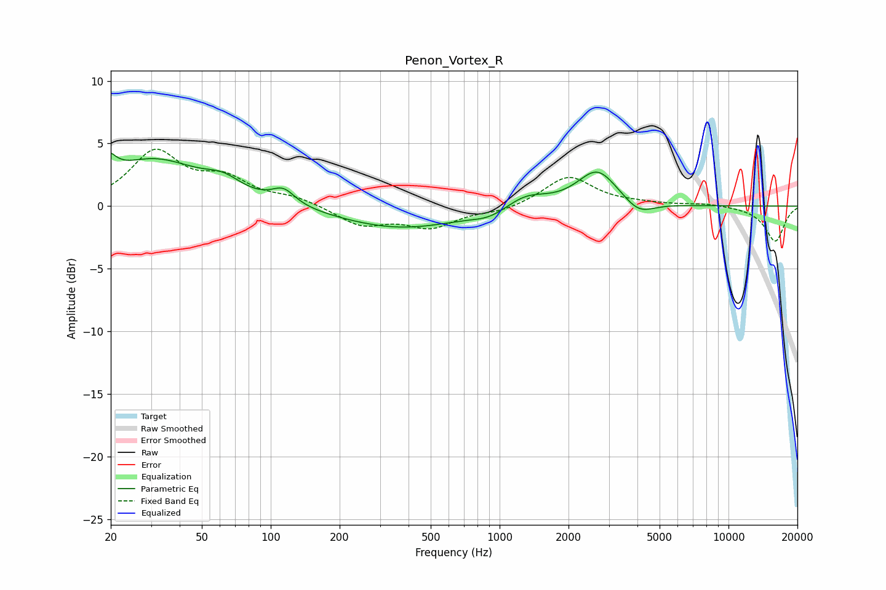

# Penon_Vortex_R
See [usage instructions](https://github.com/jaakkopasanen/AutoEq#usage) for more options and info.

### Parametric EQs
Apply preamp of -4.3 dB when using parametric equalizer.

|   # | Type    |   Fc (Hz) |    Q |   Gain (dB) |
|-----|---------|-----------|------|-------------|
|   1 | Peaking |        20 | 5.16 |         3.3 |
|   2 | Peaking |        20 | 6    |        -1.7 |
|   3 | Peaking |        31 | 0.69 |         3.6 |
|   4 | Peaking |        62 | 1.79 |         1.1 |
|   5 | Peaking |       114 | 2.8  |         1.2 |
|   6 | Peaking |       369 | 0.52 |        -1.8 |
|   7 | Peaking |       906 | 1.85 |        -0.6 |
|   8 | Peaking |      1305 | 1.55 |         1.1 |
|   9 | Peaking |      2674 | 1.63 |         2.9 |
|  10 | Peaking |      4053 | 2.17 |        -1.1 |

### Fixed Band EQs
When using fixed band (also called graphic) equalizer, apply preamp of **-4.6 dB** (if available) and set gains manually with these parameters.

|   # | Type    |   Fc (Hz) |    Q |   Gain (dB) |
|-----|---------|-----------|------|-------------|
|   1 | Peaking |        31 | 1.41 |         4.2 |
|   2 | Peaking |        62 | 1.41 |         1.9 |
|   3 | Peaking |       125 | 1.41 |         0.6 |
|   4 | Peaking |       250 | 1.41 |        -1.5 |
|   5 | Peaking |       500 | 1.41 |        -1.6 |
|   6 | Peaking |      1000 | 1.41 |        -0.4 |
|   7 | Peaking |      2000 | 1.41 |         2.4 |
|   8 | Peaking |      4000 | 1.41 |         0.2 |
|   9 | Peaking |      8000 | 1.41 |         0.2 |
|  10 | Peaking |     16000 | 1.41 |        -2.8 |

### Graphs

