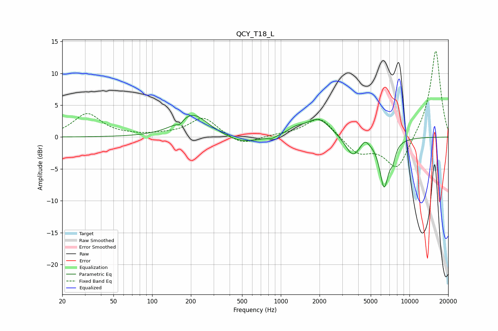

# QCY_T18_L
See [usage instructions](https://github.com/jaakkopasanen/AutoEq#usage) for more options and info.

### Parametric EQs
Apply preamp of -3.5 dB when using parametric equalizer.

|   # | Type    |   Fc (Hz) |    Q |   Gain (dB) |
|-----|---------|-----------|------|-------------|
|   1 | Peaking |       164 | 5.99 |        -0.6 |
|   2 | Peaking |       206 | 1.21 |         3.6 |
|   3 | Peaking |       507 | 1.11 |        -1.2 |
|   4 | Peaking |       852 | 4.53 |        -0.4 |
|   5 | Peaking |      1307 | 2.31 |         0.8 |
|   6 | Peaking |      1956 | 1.49 |         2.9 |
|   7 | Peaking |      3630 | 2.46 |        -3.1 |
|   8 | Peaking |      4493 | 4.41 |         1.1 |
|   9 | Peaking |      6354 | 3.89 |        -7.5 |
|  10 | Peaking |      7410 | 5.95 |        -1.9 |

### Fixed Band EQs
When using fixed band (also called graphic) equalizer, apply preamp of **-13.6 dB** (if available) and set gains manually with these parameters.

|   # | Type    |   Fc (Hz) |    Q |   Gain (dB) |
|-----|---------|-----------|------|-------------|
|   1 | Peaking |        31 | 1.41 |         3.6 |
|   2 | Peaking |        62 | 1.41 |         0.2 |
|   3 | Peaking |       125 | 1.41 |         0.3 |
|   4 | Peaking |       250 | 1.41 |         3.1 |
|   5 | Peaking |       500 | 1.41 |        -1.4 |
|   6 | Peaking |      1000 | 1.41 |         0.3 |
|   7 | Peaking |      2000 | 1.41 |         3.3 |
|   8 | Peaking |      4000 | 1.41 |        -2.6 |
|   9 | Peaking |      8000 | 1.41 |        -5.3 |
|  10 | Peaking |     16000 | 1.41 |        13.9 |

### Graphs

