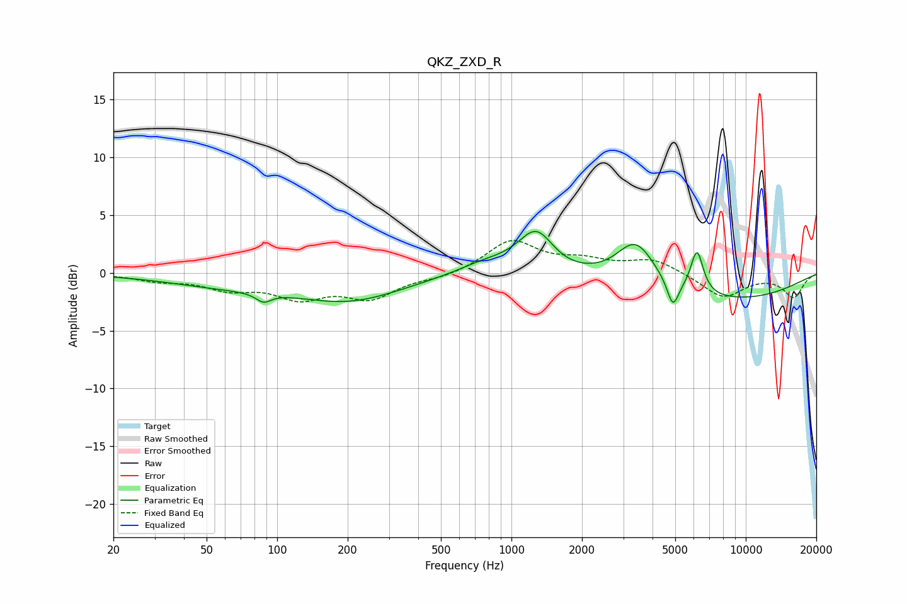

# QKZ_ZXD_R
See [usage instructions](https://github.com/jaakkopasanen/AutoEq#usage) for more options and info.

### Parametric EQs
Apply preamp of -3.7 dB when using parametric equalizer.

|   # | Type    |   Fc (Hz) |    Q |   Gain (dB) |
|-----|---------|-----------|------|-------------|
|   1 | Peaking |        61 | 0.53 |        -1   |
|   2 | Peaking |        87 | 4.49 |        -0.8 |
|   3 | Peaking |       204 | 0.61 |        -2.2 |
|   4 | Peaking |       768 | 1.18 |         0.9 |
|   5 | Peaking |      1281 | 1.79 |         3.9 |
|   6 | Peaking |      1499 | 1.58 |        -0.5 |
|   7 | Peaking |      3396 | 1.7  |         3.8 |
|   8 | Peaking |      4888 | 5.71 |        -2.4 |
|   9 | Peaking |      6191 | 5.19 |         3.7 |
|  10 | Peaking |      7800 | 0.35 |        -2.4 |

### Fixed Band EQs
When using fixed band (also called graphic) equalizer, apply preamp of **-2.9 dB** (if available) and set gains manually with these parameters.

|   # | Type    |   Fc (Hz) |    Q |   Gain (dB) |
|-----|---------|-----------|------|-------------|
|   1 | Peaking |        31 | 1.41 |        -0.6 |
|   2 | Peaking |        62 | 1.41 |        -1.2 |
|   3 | Peaking |       125 | 1.41 |        -1.9 |
|   4 | Peaking |       250 | 1.41 |        -2   |
|   5 | Peaking |       500 | 1.41 |        -0.4 |
|   6 | Peaking |      1000 | 1.41 |         2.8 |
|   7 | Peaking |      2000 | 1.41 |         0.9 |
|   8 | Peaking |      4000 | 1.41 |         1.2 |
|   9 | Peaking |      8000 | 1.41 |        -2.1 |
|  10 | Peaking |     16000 | 1.41 |        -2.1 |

### Graphs

