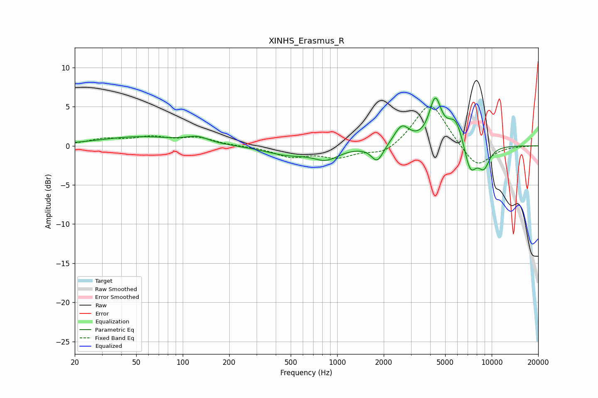

# XINHS_Erasmus_R
See [usage instructions](https://github.com/jaakkopasanen/AutoEq#usage) for more options and info.

### Parametric EQs
Apply preamp of -6.2 dB when using parametric equalizer.

|   # | Type    |   Fc (Hz) |    Q |   Gain (dB) |
|-----|---------|-----------|------|-------------|
|   1 | Peaking |        52 | 0.56 |         1.1 |
|   2 | Peaking |       125 | 2    |         0.8 |
|   3 | Peaking |       473 | 0.98 |        -1.1 |
|   4 | Peaking |       847 | 1.69 |        -1.5 |
|   5 | Peaking |      1818 | 3.67 |        -2.1 |
|   6 | Peaking |      2619 | 2.85 |         2.4 |
|   7 | Peaking |      4309 | 3.57 |         5.4 |
|   8 | Peaking |      5856 | 2.57 |         3.4 |
|   9 | Peaking |      7258 | 3.25 |        -3.8 |
|  10 | Peaking |      8897 | 3.29 |        -2.6 |

### Fixed Band EQs
When using fixed band (also called graphic) equalizer, apply preamp of **-5.1 dB** (if available) and set gains manually with these parameters.

|   # | Type    |   Fc (Hz) |    Q |   Gain (dB) |
|-----|---------|-----------|------|-------------|
|   1 | Peaking |        31 | 1.41 |         0.8 |
|   2 | Peaking |        62 | 1.41 |         1   |
|   3 | Peaking |       125 | 1.41 |         1   |
|   4 | Peaking |       250 | 1.41 |        -0   |
|   5 | Peaking |       500 | 1.41 |        -1.3 |
|   6 | Peaking |      1000 | 1.41 |        -1.3 |
|   7 | Peaking |      2000 | 1.41 |        -1.2 |
|   8 | Peaking |      4000 | 1.41 |         5.7 |
|   9 | Peaking |      8000 | 1.41 |        -3   |
|  10 | Peaking |     16000 | 1.41 |        -0   |

### Graphs

