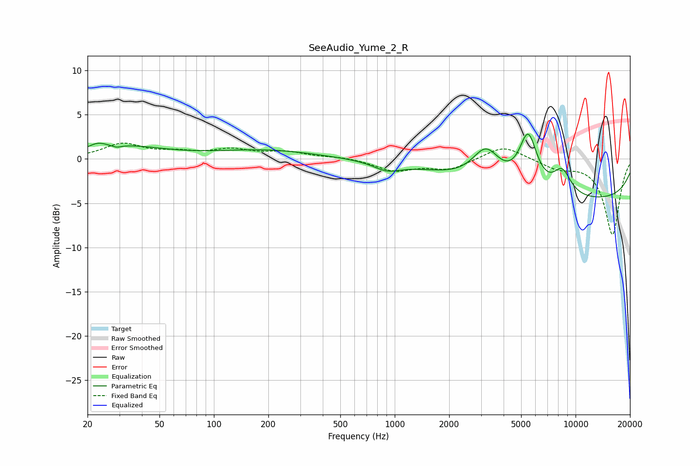

# SeeAudio_Yume_2_R
See [usage instructions](https://github.com/jaakkopasanen/AutoEq#usage) for more options and info.

### Parametric EQs
Apply preamp of -2.9 dB when using parametric equalizer.

|   # | Type    |   Fc (Hz) |    Q |   Gain (dB) |
|-----|---------|-----------|------|-------------|
|   1 | Peaking |        23 | 2.97 |         0.6 |
|   2 | Peaking |        29 | 5.76 |        -0.3 |
|   3 | Peaking |        32 | 0.65 |         1.3 |
|   4 | Peaking |       169 | 0.54 |         0.3 |
|   5 | Peaking |       204 | 0.51 |         0.7 |
|   6 | Peaking |       905 | 1.92 |        -1   |
|   7 | Peaking |      3200 | 1.84 |         3.9 |
|   8 | Peaking |      5467 | 2.79 |         6.1 |
|   9 | Peaking |      8427 | 2.61 |         2.8 |
|  10 | Peaking |     10000 | 0.18 |        -4.7 |

### Fixed Band EQs
When using fixed band (also called graphic) equalizer, apply preamp of **-1.9 dB** (if available) and set gains manually with these parameters.

|   # | Type    |   Fc (Hz) |    Q |   Gain (dB) |
|-----|---------|-----------|------|-------------|
|   1 | Peaking |        31 | 1.41 |         1.6 |
|   2 | Peaking |        62 | 1.41 |         0.6 |
|   3 | Peaking |       125 | 1.41 |         0.9 |
|   4 | Peaking |       250 | 1.41 |         0.7 |
|   5 | Peaking |       500 | 1.41 |         0.2 |
|   6 | Peaking |      1000 | 1.41 |        -1.3 |
|   7 | Peaking |      2000 | 1.41 |        -1.1 |
|   8 | Peaking |      4000 | 1.41 |         1.6 |
|   9 | Peaking |      8000 | 1.41 |        -1   |
|  10 | Peaking |     16000 | 1.41 |        -8.5 |

### Graphs

