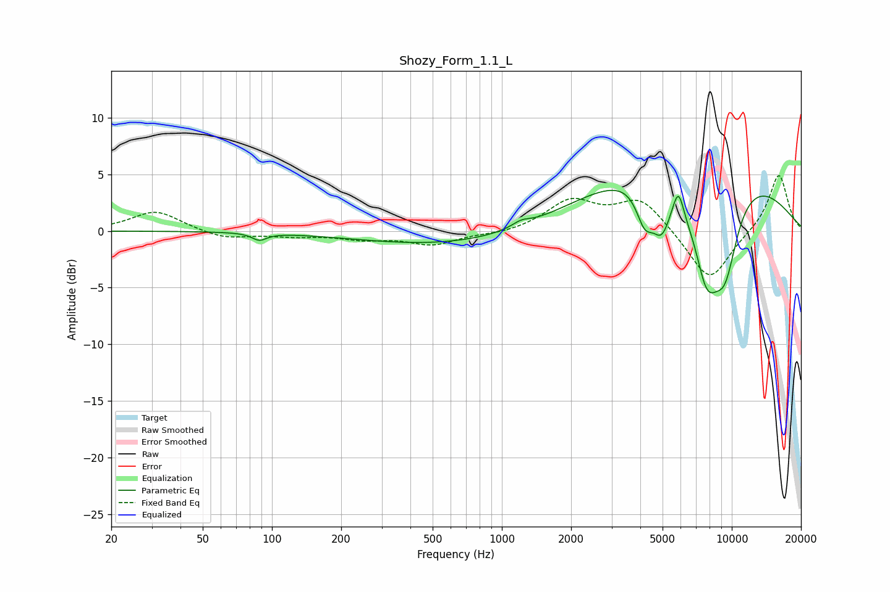

# Shozy_Form_1.1_L
See [usage instructions](https://github.com/jaakkopasanen/AutoEq#usage) for more options and info.

### Parametric EQs
Apply preamp of -3.7 dB when using parametric equalizer.

|   # | Type    |   Fc (Hz) |    Q |   Gain (dB) |
|-----|---------|-----------|------|-------------|
|   1 | Peaking |        88 | 4.52 |        -0.6 |
|   2 | Peaking |       763 | 0.3  |        -1.5 |
|   3 | Peaking |      1212 | 3.62 |         0.5 |
|   4 | Peaking |      4181 | 3.64 |        -3.2 |
|   5 | Peaking |      4958 | 3.22 |        -4.1 |
|   6 | Peaking |      5860 | 5.95 |         2.3 |
|   7 | Peaking |      6328 | 4.12 |        -0.4 |
|   8 | Peaking |      6548 | 0.29 |         7.2 |
|   9 | Peaking |      7758 | 2.14 |        -8   |
|  10 | Peaking |      9341 | 2.05 |        -7.2 |

### Fixed Band EQs
When using fixed band (also called graphic) equalizer, apply preamp of **-5.0 dB** (if available) and set gains manually with these parameters.

|   # | Type    |   Fc (Hz) |    Q |   Gain (dB) |
|-----|---------|-----------|------|-------------|
|   1 | Peaking |        31 | 1.41 |         1.8 |
|   2 | Peaking |        62 | 1.41 |        -0.7 |
|   3 | Peaking |       125 | 1.41 |        -0.4 |
|   4 | Peaking |       250 | 1.41 |        -0.6 |
|   5 | Peaking |       500 | 1.41 |        -1.2 |
|   6 | Peaking |      1000 | 1.41 |        -0.3 |
|   7 | Peaking |      2000 | 1.41 |         2.6 |
|   8 | Peaking |      4000 | 1.41 |         2.8 |
|   9 | Peaking |      8000 | 1.41 |        -4.6 |
|  10 | Peaking |     16000 | 1.41 |         5.1 |

### Graphs

