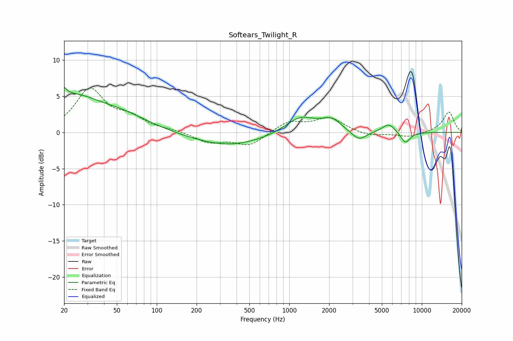

# Softears_Twilight_R
See [usage instructions](https://github.com/jaakkopasanen/AutoEq#usage) for more options and info.

### Parametric EQs
Apply preamp of -6.3 dB when using parametric equalizer.

|   # | Type    |   Fc (Hz) |    Q |   Gain (dB) |
|-----|---------|-----------|------|-------------|
|   1 | Peaking |        20 | 5.98 |         4.9 |
|   2 | Peaking |        20 | 6    |        -3.7 |
|   3 | Peaking |        22 | 0.62 |         4.7 |
|   4 | Peaking |        58 | 0.69 |         1.5 |
|   5 | Peaking |       348 | 0.51 |        -1.9 |
|   6 | Peaking |      1213 | 1.22 |         2.3 |
|   7 | Peaking |      2088 | 1.91 |         1.6 |
|   8 | Peaking |      3347 | 2.46 |        -1.4 |
|   9 | Peaking |      5618 | 2.8  |         1.2 |
|  10 | Peaking |      7529 | 3.66 |        -1.6 |

### Fixed Band EQs
When using fixed band (also called graphic) equalizer, apply preamp of **-6.2 dB** (if available) and set gains manually with these parameters.

|   # | Type    |   Fc (Hz) |    Q |   Gain (dB) |
|-----|---------|-----------|------|-------------|
|   1 | Peaking |        31 | 1.41 |         5.8 |
|   2 | Peaking |        62 | 1.41 |         1.7 |
|   3 | Peaking |       125 | 1.41 |         0.2 |
|   4 | Peaking |       250 | 1.41 |        -1.4 |
|   5 | Peaking |       500 | 1.41 |        -1.8 |
|   6 | Peaking |      1000 | 1.41 |         1.5 |
|   7 | Peaking |      2000 | 1.41 |         1.9 |
|   8 | Peaking |      4000 | 1.41 |        -0.6 |
|   9 | Peaking |      8000 | 1.41 |        -0.7 |
|  10 | Peaking |     16000 | 1.41 |         2.8 |

### Graphs

