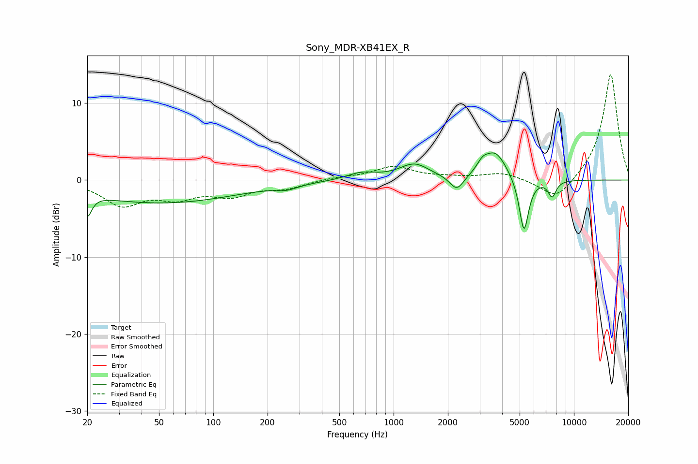

# Sony_MDR-XB41EX_R
See [usage instructions](https://github.com/jaakkopasanen/AutoEq#usage) for more options and info.

### Parametric EQs
Apply preamp of -3.6 dB when using parametric equalizer.

|   # | Type    |   Fc (Hz) |    Q |   Gain (dB) |
|-----|---------|-----------|------|-------------|
|   1 | Peaking |        20 | 5.93 |        -2.8 |
|   2 | Peaking |        51 | 0.33 |        -3   |
|   3 | Peaking |       255 | 2.34 |        -0.6 |
|   4 | Peaking |       663 | 1.72 |         0.9 |
|   5 | Peaking |      1303 | 1.7  |         2   |
|   6 | Peaking |      2242 | 3.67 |        -2   |
|   7 | Peaking |      3116 | 4.5  |         1.1 |
|   8 | Peaking |      3671 | 2.23 |         3.6 |
|   9 | Peaking |      5283 | 5.29 |        -7.2 |
|  10 | Peaking |      7570 | 6    |        -2.1 |

### Fixed Band EQs
When using fixed band (also called graphic) equalizer, apply preamp of **-13.8 dB** (if available) and set gains manually with these parameters.

|   # | Type    |   Fc (Hz) |    Q |   Gain (dB) |
|-----|---------|-----------|------|-------------|
|   1 | Peaking |        31 | 1.41 |        -3.1 |
|   2 | Peaking |        62 | 1.41 |        -1.9 |
|   3 | Peaking |       125 | 1.41 |        -1.8 |
|   4 | Peaking |       250 | 1.41 |        -0.9 |
|   5 | Peaking |       500 | 1.41 |         0.3 |
|   6 | Peaking |      1000 | 1.41 |         1.7 |
|   7 | Peaking |      2000 | 1.41 |         0.2 |
|   8 | Peaking |      4000 | 1.41 |         0.9 |
|   9 | Peaking |      8000 | 1.41 |        -2.8 |
|  10 | Peaking |     16000 | 1.41 |        13.9 |

### Graphs

