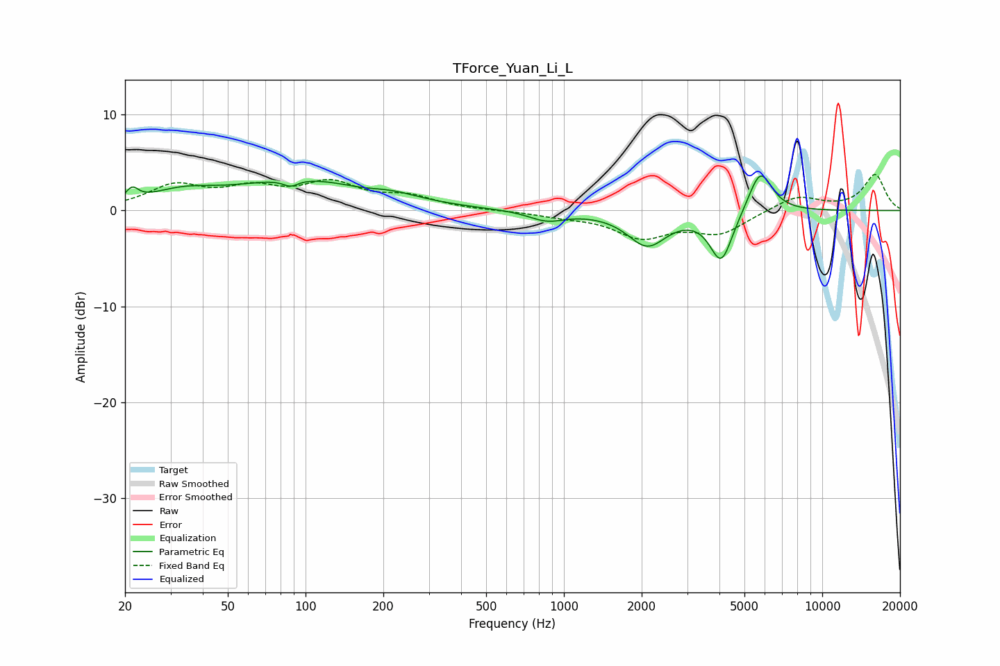

# TForce_Yuan_Li_L
See [usage instructions](https://github.com/jaakkopasanen/AutoEq#usage) for more options and info.

### Parametric EQs
Apply preamp of -3.7 dB when using parametric equalizer.

|   # | Type    |   Fc (Hz) |    Q |   Gain (dB) |
|-----|---------|-----------|------|-------------|
|   1 | Peaking |        21 | 5.99 |         1.3 |
|   2 | Peaking |        33 | 1.14 |         1.4 |
|   3 | Peaking |        88 | 4.86 |        -0.7 |
|   4 | Peaking |        96 | 0.53 |         3.1 |
|   5 | Peaking |       167 | 1.75 |        -0.3 |
|   6 | Peaking |       213 | 1.3  |         0.7 |
|   7 | Peaking |       859 | 2.02 |        -1   |
|   8 | Peaking |      2101 | 1.87 |        -3.5 |
|   9 | Peaking |      4067 | 3.16 |        -5.3 |
|  10 | Peaking |      5754 | 2.98 |         4.5 |

### Fixed Band EQs
When using fixed band (also called graphic) equalizer, apply preamp of **-3.9 dB** (if available) and set gains manually with these parameters.

|   # | Type    |   Fc (Hz) |    Q |   Gain (dB) |
|-----|---------|-----------|------|-------------|
|   1 | Peaking |        31 | 1.41 |         2.4 |
|   2 | Peaking |        62 | 1.41 |         2   |
|   3 | Peaking |       125 | 1.41 |         2.6 |
|   4 | Peaking |       250 | 1.41 |         1.3 |
|   5 | Peaking |       500 | 1.41 |        -0   |
|   6 | Peaking |      1000 | 1.41 |        -0.5 |
|   7 | Peaking |      2000 | 1.41 |        -2.6 |
|   8 | Peaking |      4000 | 1.41 |        -2.3 |
|   9 | Peaking |      8000 | 1.41 |         1.6 |
|  10 | Peaking |     16000 | 1.41 |         3.7 |

### Graphs

