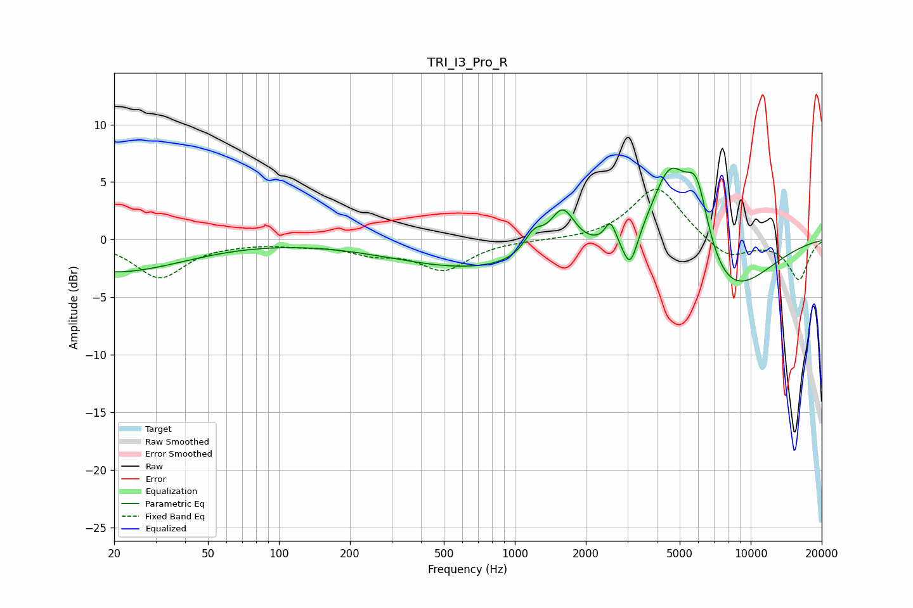

# TRI_I3_Pro_R
See [usage instructions](https://github.com/jaakkopasanen/AutoEq#usage) for more options and info.

### Parametric EQs
Apply preamp of -6.3 dB when using parametric equalizer.

|   # | Type    |   Fc (Hz) |    Q |   Gain (dB) |
|-----|---------|-----------|------|-------------|
|   1 | Peaking |        20 | 0.48 |        -2.9 |
|   2 | Peaking |        28 | 0.29 |         0.1 |
|   3 | Peaking |       697 | 0.4  |        -2.5 |
|   4 | Peaking |      1204 | 3.31 |         1.8 |
|   5 | Peaking |      1594 | 2.65 |         3.7 |
|   6 | Peaking |      2544 | 6    |         1.8 |
|   7 | Peaking |      3083 | 4.38 |        -3.2 |
|   8 | Peaking |      4551 | 1.67 |         7.8 |
|   9 | Peaking |      5911 | 2.63 |         6.1 |
|  10 | Peaking |      7661 | 0.71 |        -5.6 |

### Fixed Band EQs
When using fixed band (also called graphic) equalizer, apply preamp of **-4.5 dB** (if available) and set gains manually with these parameters.

|   # | Type    |   Fc (Hz) |    Q |   Gain (dB) |
|-----|---------|-----------|------|-------------|
|   1 | Peaking |        31 | 1.41 |        -3.2 |
|   2 | Peaking |        62 | 1.41 |        -0.2 |
|   3 | Peaking |       125 | 1.41 |        -0.3 |
|   4 | Peaking |       250 | 1.41 |        -1   |
|   5 | Peaking |       500 | 1.41 |        -2.5 |
|   6 | Peaking |      1000 | 1.41 |        -0   |
|   7 | Peaking |      2000 | 1.41 |        -0   |
|   8 | Peaking |      4000 | 1.41 |         4.7 |
|   9 | Peaking |      8000 | 1.41 |        -1.7 |
|  10 | Peaking |     16000 | 1.41 |        -3.4 |

### Graphs

