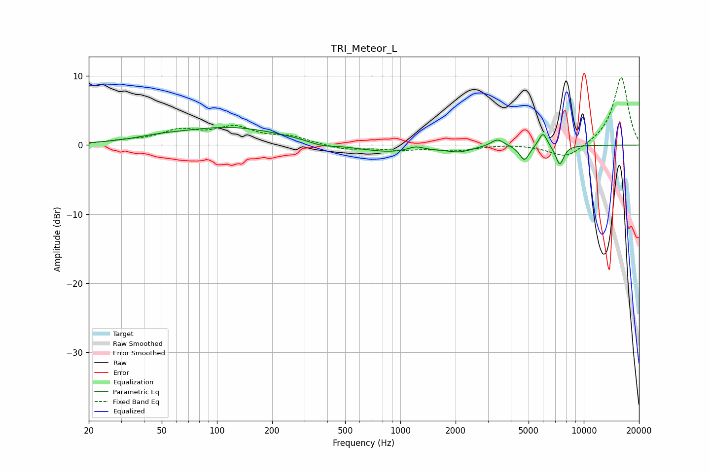

# TRI_Meteor_L
See [usage instructions](https://github.com/jaakkopasanen/AutoEq#usage) for more options and info.

### Parametric EQs
Apply preamp of -2.6 dB when using parametric equalizer.

|   # | Type    |   Fc (Hz) |    Q |   Gain (dB) |
|-----|---------|-----------|------|-------------|
|   1 | Peaking |        48 | 1.14 |         0.4 |
|   2 | Peaking |       118 | 0.48 |         2.5 |
|   3 | Peaking |       371 | 2.14 |        -0.5 |
|   4 | Peaking |       921 | 0.68 |        -1.2 |
|   5 | Peaking |      1209 | 2.99 |         0.7 |
|   6 | Peaking |      2107 | 2.28 |        -0.7 |
|   7 | Peaking |      3383 | 3.99 |         1.1 |
|   8 | Peaking |      4747 | 5.22 |        -2.2 |
|   9 | Peaking |      5990 | 6    |         2.1 |
|  10 | Peaking |      7392 | 5.88 |        -2.8 |

### Fixed Band EQs
When using fixed band (also called graphic) equalizer, apply preamp of **-9.8 dB** (if available) and set gains manually with these parameters.

|   # | Type    |   Fc (Hz) |    Q |   Gain (dB) |
|-----|---------|-----------|------|-------------|
|   1 | Peaking |        31 | 1.41 |         0.5 |
|   2 | Peaking |        62 | 1.41 |         1.9 |
|   3 | Peaking |       125 | 1.41 |         2.3 |
|   4 | Peaking |       250 | 1.41 |         1.1 |
|   5 | Peaking |       500 | 1.41 |        -0.7 |
|   6 | Peaking |      1000 | 1.41 |        -0.6 |
|   7 | Peaking |      2000 | 1.41 |        -0.7 |
|   8 | Peaking |      4000 | 1.41 |         0.2 |
|   9 | Peaking |      8000 | 1.41 |        -2   |
|  10 | Peaking |     16000 | 1.41 |         9.9 |

### Graphs

