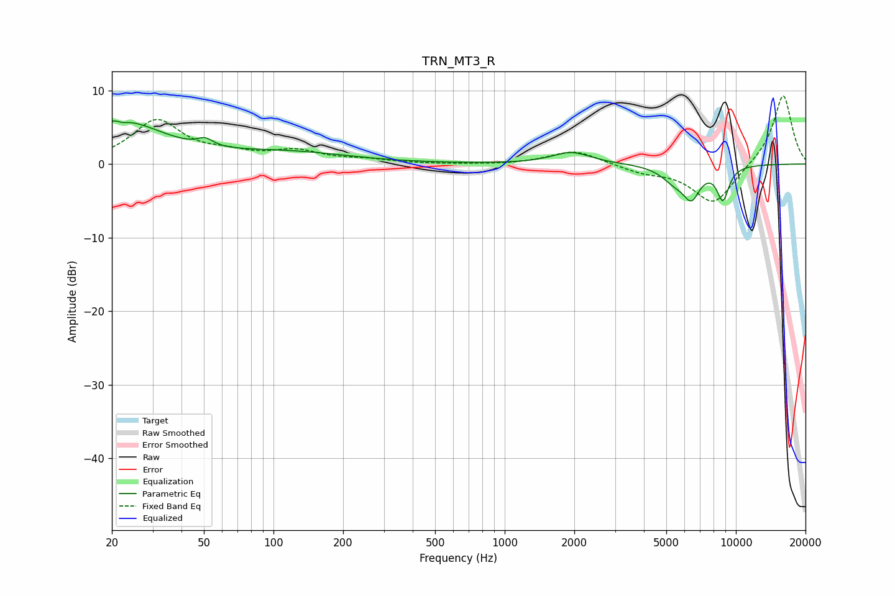

# TRN_MT3_R
See [usage instructions](https://github.com/jaakkopasanen/AutoEq#usage) for more options and info.

### Parametric EQs
Apply preamp of -5.9 dB when using parametric equalizer.

|   # | Type    |   Fc (Hz) |    Q |   Gain (dB) |
|-----|---------|-----------|------|-------------|
|   1 | Peaking |        20 | 0.69 |         4.5 |
|   2 | Peaking |        22 | 5.93 |         3.1 |
|   3 | Peaking |        22 | 5.99 |        -3.3 |
|   4 | Peaking |        24 | 0.93 |         1.3 |
|   5 | Peaking |        51 | 4.36 |         1   |
|   6 | Peaking |       116 | 0.53 |         1.5 |
|   7 | Peaking |      1942 | 1.69 |         1.6 |
|   8 | Peaking |      5404 | 2.49 |        -1.8 |
|   9 | Peaking |      6421 | 3.64 |        -3.8 |
|  10 | Peaking |      8787 | 4.9  |        -4.4 |

### Fixed Band EQs
When using fixed band (also called graphic) equalizer, apply preamp of **-9.4 dB** (if available) and set gains manually with these parameters.

|   # | Type    |   Fc (Hz) |    Q |   Gain (dB) |
|-----|---------|-----------|------|-------------|
|   1 | Peaking |        31 | 1.41 |         5.8 |
|   2 | Peaking |        62 | 1.41 |         1.1 |
|   3 | Peaking |       125 | 1.41 |         1.6 |
|   4 | Peaking |       250 | 1.41 |         0.5 |
|   5 | Peaking |       500 | 1.41 |        -0   |
|   6 | Peaking |      1000 | 1.41 |        -0.1 |
|   7 | Peaking |      2000 | 1.41 |         1.9 |
|   8 | Peaking |      4000 | 1.41 |        -1   |
|   9 | Peaking |      8000 | 1.41 |        -5.5 |
|  10 | Peaking |     16000 | 1.41 |         9.6 |

### Graphs

