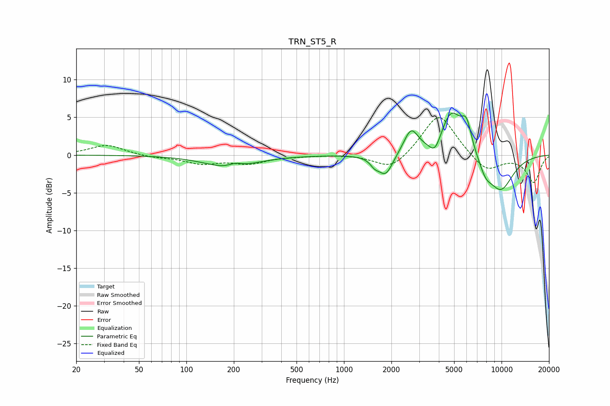

# TRN_ST5_R
See [usage instructions](https://github.com/jaakkopasanen/AutoEq#usage) for more options and info.

### Parametric EQs
Apply preamp of -5.7 dB when using parametric equalizer.

|   # | Type    |   Fc (Hz) |    Q |   Gain (dB) |
|-----|---------|-----------|------|-------------|
|   1 | Peaking |       190 | 0.94 |        -1.7 |
|   2 | Peaking |       204 | 2.96 |         0.6 |
|   3 | Peaking |      1564 | 5.07 |        -0.8 |
|   4 | Peaking |      1839 | 3.06 |        -2.8 |
|   5 | Peaking |      2665 | 3.07 |         3.2 |
|   6 | Peaking |      3787 | 3.81 |        -2   |
|   7 | Peaking |      4793 | 1.99 |         5.8 |
|   8 | Peaking |      5994 | 4.19 |         3.4 |
|   9 | Peaking |      7909 | 3.29 |        -1.5 |
|  10 | Peaking |      9841 | 1.44 |        -4.7 |

### Fixed Band EQs
When using fixed band (also called graphic) equalizer, apply preamp of **-5.0 dB** (if available) and set gains manually with these parameters.

|   # | Type    |   Fc (Hz) |    Q |   Gain (dB) |
|-----|---------|-----------|------|-------------|
|   1 | Peaking |        31 | 1.41 |         1.4 |
|   2 | Peaking |        62 | 1.41 |        -0.3 |
|   3 | Peaking |       125 | 1.41 |        -1.1 |
|   4 | Peaking |       250 | 1.41 |        -1   |
|   5 | Peaking |       500 | 1.41 |        -0.1 |
|   6 | Peaking |      1000 | 1.41 |         0.1 |
|   7 | Peaking |      2000 | 1.41 |        -2.1 |
|   8 | Peaking |      4000 | 1.41 |         5.7 |
|   9 | Peaking |      8000 | 1.41 |        -2.3 |
|  10 | Peaking |     16000 | 1.41 |        -3.6 |

### Graphs

