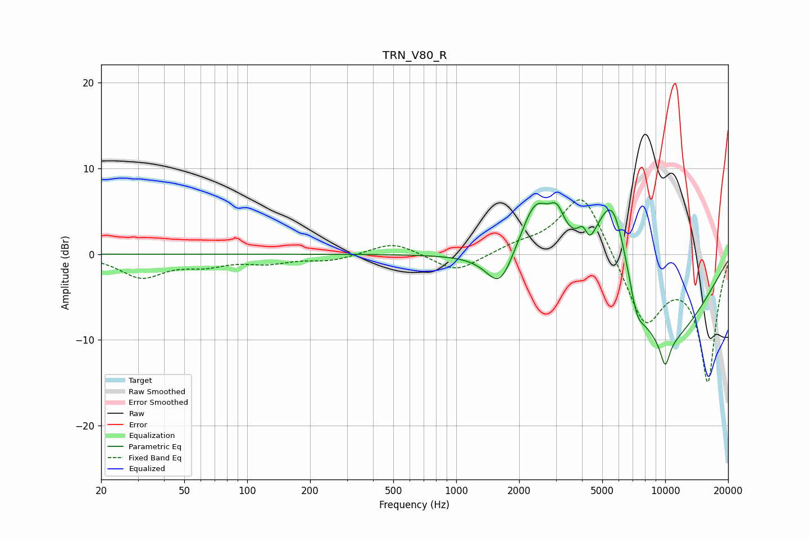

# TRN_V80_R
See [usage instructions](https://github.com/jaakkopasanen/AutoEq#usage) for more options and info.

### Parametric EQs
Apply preamp of -6.1 dB when using parametric equalizer.

|   # | Type    |   Fc (Hz) |    Q |   Gain (dB) |
|-----|---------|-----------|------|-------------|
|   1 | Peaking |      1620 | 2.18 |        -4.4 |
|   2 | Peaking |      2395 | 1.86 |         6.9 |
|   3 | Peaking |      3034 | 3.81 |         3.1 |
|   4 | Peaking |      4060 | 5.73 |         2   |
|   5 | Peaking |      4307 | 4.96 |        -2   |
|   6 | Peaking |      5605 | 1.34 |        14.3 |
|   7 | Peaking |      7328 | 3.78 |        -4   |
|   8 | Peaking |      7376 | 4.03 |         0.9 |
|   9 | Peaking |      9010 | 0.5  |       -13.2 |
|  10 | Peaking |     10000 | 5.43 |        -3.1 |

### Fixed Band EQs
When using fixed band (also called graphic) equalizer, apply preamp of **-6.4 dB** (if available) and set gains manually with these parameters.

|   # | Type    |   Fc (Hz) |    Q |   Gain (dB) |
|-----|---------|-----------|------|-------------|
|   1 | Peaking |        31 | 1.41 |        -2.6 |
|   2 | Peaking |        62 | 1.41 |        -1.1 |
|   3 | Peaking |       125 | 1.41 |        -0.9 |
|   4 | Peaking |       250 | 1.41 |        -0.7 |
|   5 | Peaking |       500 | 1.41 |         1.5 |
|   6 | Peaking |      1000 | 1.41 |        -2.2 |
|   7 | Peaking |      2000 | 1.41 |         0.9 |
|   8 | Peaking |      4000 | 1.41 |         7.7 |
|   9 | Peaking |      8000 | 1.41 |        -8.1 |
|  10 | Peaking |     16000 | 1.41 |       -14.7 |

### Graphs

