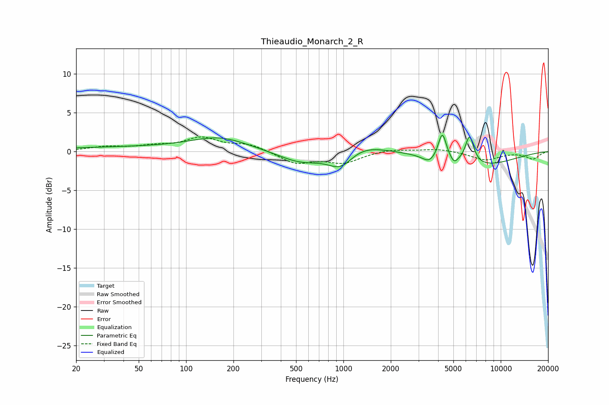

# Thieaudio_Monarch_2_R
See [usage instructions](https://github.com/jaakkopasanen/AutoEq#usage) for more options and info.

### Parametric EQs
Apply preamp of -2.2 dB when using parametric equalizer.

|   # | Type    |   Fc (Hz) |    Q |   Gain (dB) |
|-----|---------|-----------|------|-------------|
|   1 | Peaking |        67 | 0.18 |         0.6 |
|   2 | Peaking |       163 | 0.84 |         1.4 |
|   3 | Peaking |       537 | 0.94 |        -1.6 |
|   4 | Peaking |       968 | 1.68 |        -2.6 |
|   5 | Peaking |      1207 | 0.96 |         1.6 |
|   6 | Peaking |      3512 | 3.33 |        -0.9 |
|   7 | Peaking |      4252 | 5.44 |         3.5 |
|   8 | Peaking |      5049 | 5.93 |        -0.8 |
|   9 | Peaking |      6336 | 5.09 |         3.6 |
|  10 | Peaking |      7318 | 0.6  |        -1.9 |

### Fixed Band EQs
When using fixed band (also called graphic) equalizer, apply preamp of **-2.0 dB** (if available) and set gains manually with these parameters.

|   # | Type    |   Fc (Hz) |    Q |   Gain (dB) |
|-----|---------|-----------|------|-------------|
|   1 | Peaking |        31 | 1.41 |         0.5 |
|   2 | Peaking |        62 | 1.41 |         0.5 |
|   3 | Peaking |       125 | 1.41 |         1.6 |
|   4 | Peaking |       250 | 1.41 |         0.9 |
|   5 | Peaking |       500 | 1.41 |        -1.5 |
|   6 | Peaking |      1000 | 1.41 |        -1.4 |
|   7 | Peaking |      2000 | 1.41 |         0.3 |
|   8 | Peaking |      4000 | 1.41 |         0.4 |
|   9 | Peaking |      8000 | 1.41 |        -1.1 |
|  10 | Peaking |     16000 | 1.41 |        -0.9 |

### Graphs

