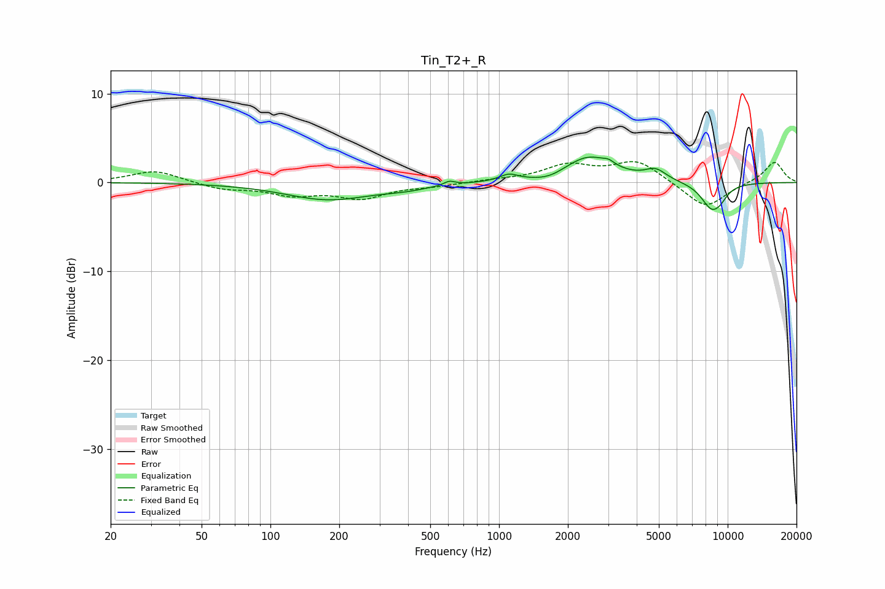

# Tin_T2+_R
See [usage instructions](https://github.com/jaakkopasanen/AutoEq#usage) for more options and info.

### Parametric EQs
Apply preamp of -3.0 dB when using parametric equalizer.

|   # | Type    |   Fc (Hz) |    Q |   Gain (dB) |
|-----|---------|-----------|------|-------------|
|   1 | Peaking |       179 | 0.75 |        -1.9 |
|   2 | Peaking |       387 | 1.36 |        -0.4 |
|   3 | Peaking |       606 | 6    |         0.5 |
|   4 | Peaking |      1104 | 3.53 |         0.7 |
|   5 | Peaking |      1655 | 2.07 |        -0.6 |
|   6 | Peaking |      2464 | 1.3  |         2.9 |
|   7 | Peaking |      3017 | 6    |         0.4 |
|   8 | Peaking |      4841 | 2.98 |         1.2 |
|   9 | Peaking |      8514 | 2.73 |        -2.9 |
|  10 | Peaking |      9334 | 4.28 |        -0.6 |

### Fixed Band EQs
When using fixed band (also called graphic) equalizer, apply preamp of **-2.4 dB** (if available) and set gains manually with these parameters.

|   # | Type    |   Fc (Hz) |    Q |   Gain (dB) |
|-----|---------|-----------|------|-------------|
|   1 | Peaking |        31 | 1.41 |         1.4 |
|   2 | Peaking |        62 | 1.41 |        -0.7 |
|   3 | Peaking |       125 | 1.41 |        -1.2 |
|   4 | Peaking |       250 | 1.41 |        -1.6 |
|   5 | Peaking |       500 | 1.41 |        -0.3 |
|   6 | Peaking |      1000 | 1.41 |         0.2 |
|   7 | Peaking |      2000 | 1.41 |         1.8 |
|   8 | Peaking |      4000 | 1.41 |         2.4 |
|   9 | Peaking |      8000 | 1.41 |        -3   |
|  10 | Peaking |     16000 | 1.41 |         2.4 |

### Graphs

