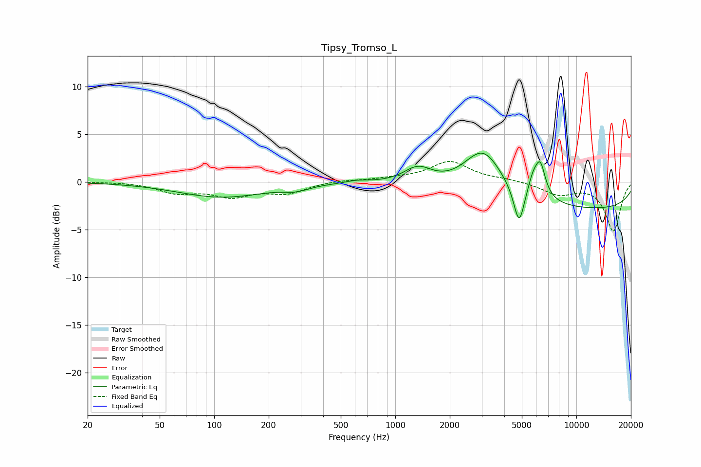

# Tipsy_Tromso_L
See [usage instructions](https://github.com/jaakkopasanen/AutoEq#usage) for more options and info.

### Parametric EQs
Apply preamp of -3.1 dB when using parametric equalizer.

|   # | Type    |   Fc (Hz) |    Q |   Gain (dB) |
|-----|---------|-----------|------|-------------|
|   1 | Peaking |       110 | 0.59 |        -1.6 |
|   2 | Peaking |       283 | 2.06 |        -0.5 |
|   3 | Peaking |       612 | 2.24 |         0.3 |
|   4 | Peaking |      1334 | 1.8  |         1.7 |
|   5 | Peaking |      3058 | 1.3  |         4.9 |
|   6 | Peaking |      4832 | 4.62 |        -4.3 |
|   7 | Peaking |      5788 | 2.32 |         1.4 |
|   8 | Peaking |      5795 | 5.37 |         1.1 |
|   9 | Peaking |      6332 | 5.22 |         2.8 |
|  10 | Peaking |     10000 | 0.18 |        -2.9 |

### Fixed Band EQs
When using fixed band (also called graphic) equalizer, apply preamp of **-2.2 dB** (if available) and set gains manually with these parameters.

|   # | Type    |   Fc (Hz) |    Q |   Gain (dB) |
|-----|---------|-----------|------|-------------|
|   1 | Peaking |        31 | 1.41 |         0   |
|   2 | Peaking |        62 | 1.41 |        -1.1 |
|   3 | Peaking |       125 | 1.41 |        -1.4 |
|   4 | Peaking |       250 | 1.41 |        -1.1 |
|   5 | Peaking |       500 | 1.41 |         0.2 |
|   6 | Peaking |      1000 | 1.41 |         0.3 |
|   7 | Peaking |      2000 | 1.41 |         2.1 |
|   8 | Peaking |      4000 | 1.41 |         0.2 |
|   9 | Peaking |      8000 | 1.41 |        -1.3 |
|  10 | Peaking |     16000 | 1.41 |        -5.1 |

### Graphs

