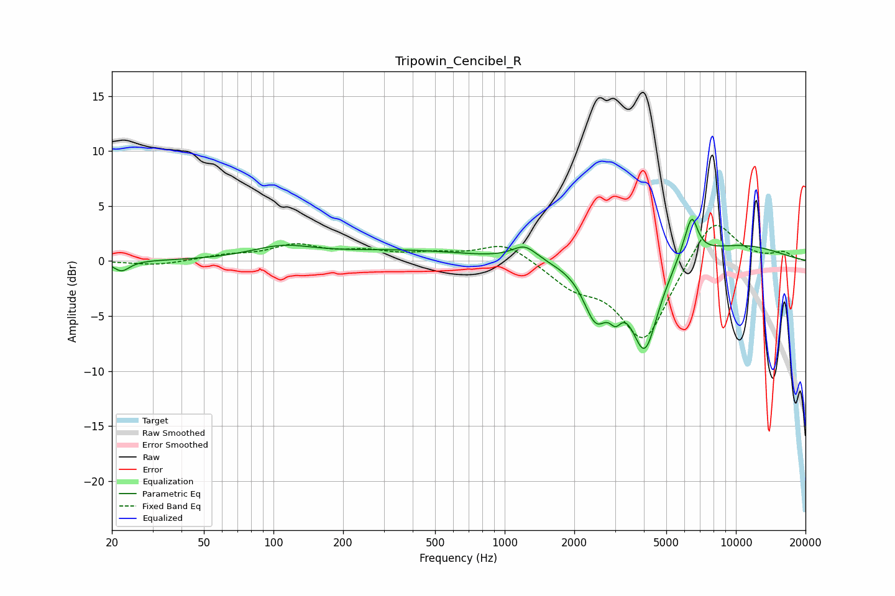

# Tripowin_Cencibel_R
See [usage instructions](https://github.com/jaakkopasanen/AutoEq#usage) for more options and info.

### Parametric EQs
Apply preamp of -3.9 dB when using parametric equalizer.

|   # | Type    |   Fc (Hz) |    Q |   Gain (dB) |
|-----|---------|-----------|------|-------------|
|   1 | Peaking |        22 | 4.22 |        -0.9 |
|   2 | Peaking |       109 | 1.04 |         1.1 |
|   3 | Peaking |       362 | 0.46 |         0.9 |
|   4 | Peaking |      1221 | 2.61 |         1.3 |
|   5 | Peaking |      2476 | 2.64 |        -4.6 |
|   6 | Peaking |      3016 | 5.52 |        -1.7 |
|   7 | Peaking |      4034 | 2.37 |        -8   |
|   8 | Peaking |      6265 | 3.29 |         2   |
|   9 | Peaking |      6468 | 6    |         2.1 |
|  10 | Peaking |     10000 | 0.54 |         1.5 |

### Fixed Band EQs
When using fixed band (also called graphic) equalizer, apply preamp of **-3.3 dB** (if available) and set gains manually with these parameters.

|   # | Type    |   Fc (Hz) |    Q |   Gain (dB) |
|-----|---------|-----------|------|-------------|
|   1 | Peaking |        31 | 1.41 |        -0.4 |
|   2 | Peaking |        62 | 1.41 |         0.4 |
|   3 | Peaking |       125 | 1.41 |         1.3 |
|   4 | Peaking |       250 | 1.41 |         0.7 |
|   5 | Peaking |       500 | 1.41 |         0.6 |
|   6 | Peaking |      1000 | 1.41 |         1.7 |
|   7 | Peaking |      2000 | 1.41 |        -2   |
|   8 | Peaking |      4000 | 1.41 |        -7.3 |
|   9 | Peaking |      8000 | 1.41 |         4.3 |
|  10 | Peaking |     16000 | 1.41 |         0.7 |

### Graphs

