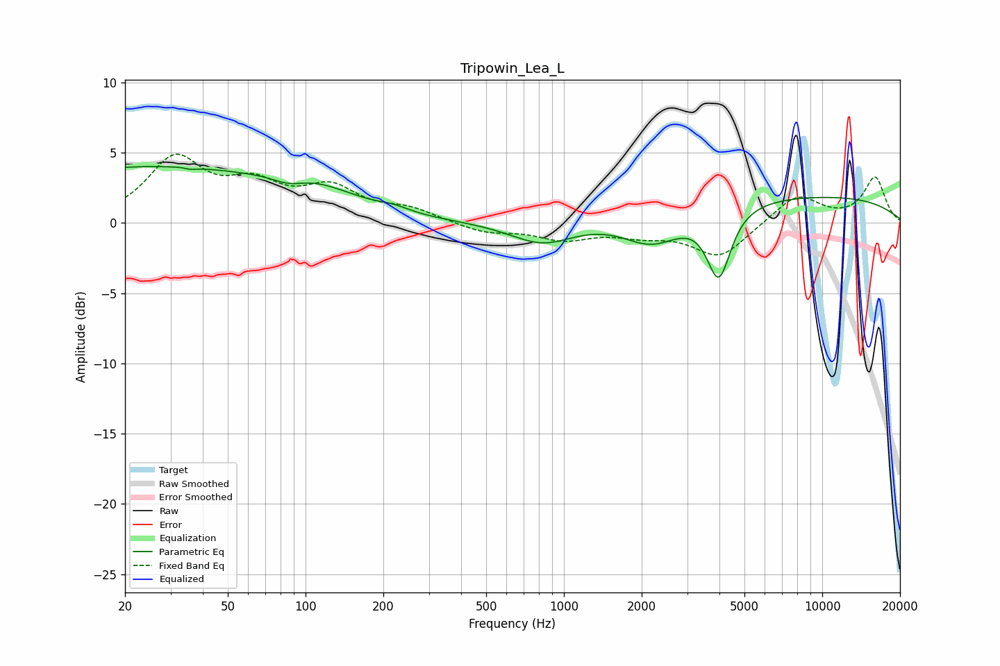

# Tripowin_Lea_L
See [usage instructions](https://github.com/jaakkopasanen/AutoEq#usage) for more options and info.

### Parametric EQs
Apply preamp of -4.1 dB when using parametric equalizer.

|   # | Type    |   Fc (Hz) |    Q |   Gain (dB) |
|-----|---------|-----------|------|-------------|
|   1 | Peaking |        23 | 0.26 |         3.9 |
|   2 | Peaking |        35 | 5.42 |         2.7 |
|   3 | Peaking |        35 | 5.47 |        -2.8 |
|   4 | Peaking |        86 | 2.15 |        -0.7 |
|   5 | Peaking |       106 | 0.84 |         1.4 |
|   6 | Peaking |       219 | 2.27 |         0.3 |
|   7 | Peaking |       830 | 1.1  |        -1.7 |
|   8 | Peaking |      2201 | 1.15 |        -2.5 |
|   9 | Peaking |      3978 | 3.07 |        -4.9 |
|  10 | Peaking |      6798 | 0.18 |         2   |

### Fixed Band EQs
When using fixed band (also called graphic) equalizer, apply preamp of **-5.0 dB** (if available) and set gains manually with these parameters.

|   # | Type    |   Fc (Hz) |    Q |   Gain (dB) |
|-----|---------|-----------|------|-------------|
|   1 | Peaking |        31 | 1.41 |         4.4 |
|   2 | Peaking |        62 | 1.41 |         2.3 |
|   3 | Peaking |       125 | 1.41 |         2.2 |
|   4 | Peaking |       250 | 1.41 |         0.9 |
|   5 | Peaking |       500 | 1.41 |        -0.7 |
|   6 | Peaking |      1000 | 1.41 |        -1.1 |
|   7 | Peaking |      2000 | 1.41 |        -0.7 |
|   8 | Peaking |      4000 | 1.41 |        -2.4 |
|   9 | Peaking |      8000 | 1.41 |         2   |
|  10 | Peaking |     16000 | 1.41 |         3.2 |

### Graphs

