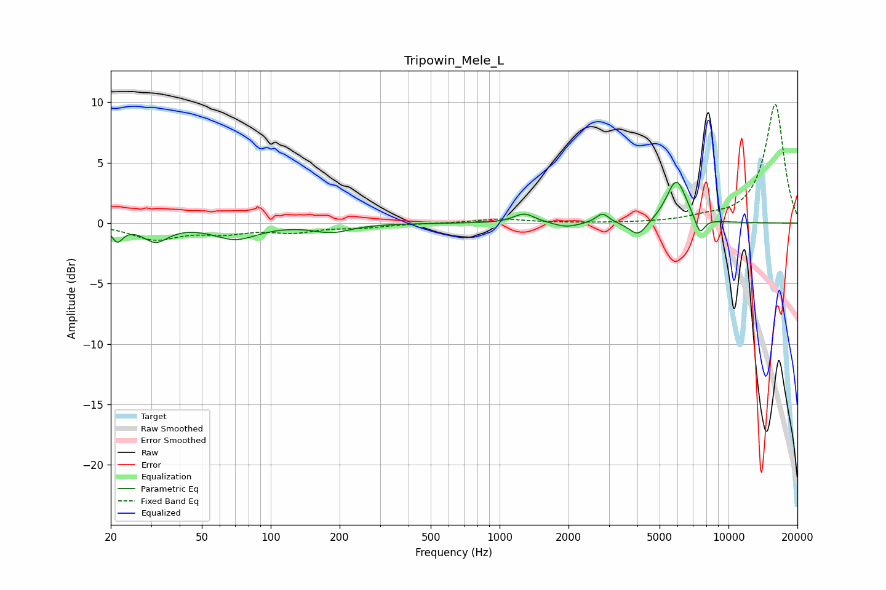

# Tripowin_Mele_L
See [usage instructions](https://github.com/jaakkopasanen/AutoEq#usage) for more options and info.

### Parametric EQs
Apply preamp of -3.5 dB when using parametric equalizer.

|   # | Type    |   Fc (Hz) |    Q |   Gain (dB) |
|-----|---------|-----------|------|-------------|
|   1 | Peaking |        21 | 5.91 |        -1.2 |
|   2 | Peaking |        31 | 2.58 |        -1.4 |
|   3 | Peaking |        70 | 1.48 |        -1.3 |
|   4 | Peaking |       185 | 1.74 |        -0.7 |
|   5 | Peaking |      1281 | 3.09 |         0.8 |
|   6 | Peaking |      1956 | 2.65 |        -0.4 |
|   7 | Peaking |      2815 | 5.06 |         0.8 |
|   8 | Peaking |      4030 | 3.59 |        -1.3 |
|   9 | Peaking |      5920 | 3.13 |         3.6 |
|  10 | Peaking |      7498 | 6    |        -1.5 |

### Fixed Band EQs
When using fixed band (also called graphic) equalizer, apply preamp of **-9.9 dB** (if available) and set gains manually with these parameters.

|   # | Type    |   Fc (Hz) |    Q |   Gain (dB) |
|-----|---------|-----------|------|-------------|
|   1 | Peaking |        31 | 1.41 |        -1.3 |
|   2 | Peaking |        62 | 1.41 |        -0.7 |
|   3 | Peaking |       125 | 1.41 |        -0.6 |
|   4 | Peaking |       250 | 1.41 |        -0.3 |
|   5 | Peaking |       500 | 1.41 |        -0   |
|   6 | Peaking |      1000 | 1.41 |         0.3 |
|   7 | Peaking |      2000 | 1.41 |         0   |
|   8 | Peaking |      4000 | 1.41 |        -0   |
|   9 | Peaking |      8000 | 1.41 |         0.3 |
|  10 | Peaking |     16000 | 1.41 |         9.9 |

### Graphs

