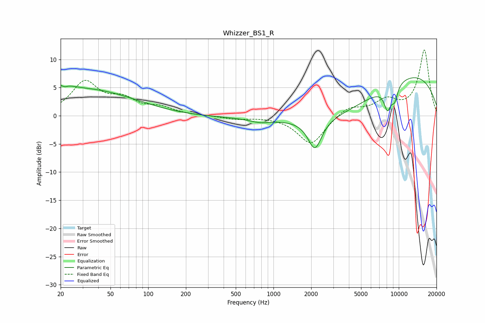

# Whizzer_BS1_R
See [usage instructions](https://github.com/jaakkopasanen/AutoEq#usage) for more options and info.

### Parametric EQs
Apply preamp of -6.8 dB when using parametric equalizer.

|   # | Type    |   Fc (Hz) |    Q |   Gain (dB) |
|-----|---------|-----------|------|-------------|
|   1 | Peaking |        20 | 2.03 |         1.6 |
|   2 | Peaking |        21 | 5.87 |        -0.6 |
|   3 | Peaking |        32 | 0.35 |         4.7 |
|   4 | Peaking |       170 | 0.18 |        -0.3 |
|   5 | Peaking |       780 | 1.74 |        -0.6 |
|   6 | Peaking |      2139 | 2.59 |        -5.4 |
|   7 | Peaking |      3537 | 0.36 |        -7   |
|   8 | Peaking |      7997 | 0.2  |         9.7 |
|   9 | Peaking |      8138 | 4.73 |        -3.8 |
|  10 | Peaking |      9261 | 5.04 |        -2.6 |

### Fixed Band EQs
When using fixed band (also called graphic) equalizer, apply preamp of **-11.8 dB** (if available) and set gains manually with these parameters.

|   # | Type    |   Fc (Hz) |    Q |   Gain (dB) |
|-----|---------|-----------|------|-------------|
|   1 | Peaking |        31 | 1.41 |         5.8 |
|   2 | Peaking |        62 | 1.41 |         2.5 |
|   3 | Peaking |       125 | 1.41 |         1.2 |
|   4 | Peaking |       250 | 1.41 |         0   |
|   5 | Peaking |       500 | 1.41 |        -0.5 |
|   6 | Peaking |      1000 | 1.41 |        -0   |
|   7 | Peaking |      2000 | 1.41 |        -5.1 |
|   8 | Peaking |      4000 | 1.41 |         1.7 |
|   9 | Peaking |      8000 | 1.41 |         2.5 |
|  10 | Peaking |     16000 | 1.41 |        11.6 |

### Graphs

