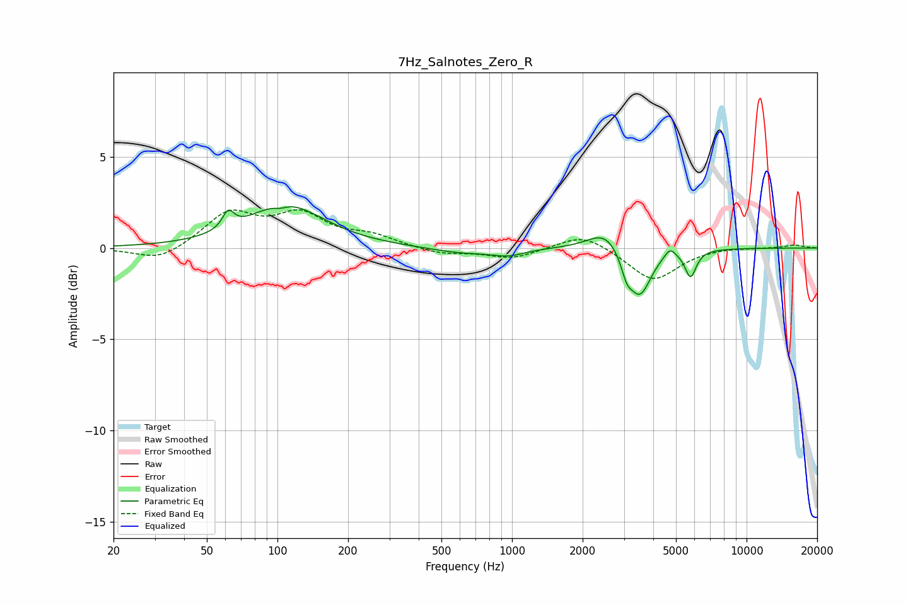

# 7Hz_Salnotes_Zero_R
See [usage instructions](https://github.com/jaakkopasanen/AutoEq#usage) for more options and info.

### Parametric EQs
Apply preamp of -2.4 dB when using parametric equalizer.

|   # | Type    |   Fc (Hz) |    Q |   Gain (dB) |
|-----|---------|-----------|------|-------------|
|   1 | Peaking |        62 | 5.95 |         0.9 |
|   2 | Peaking |       103 | 5.36 |        -0.2 |
|   3 | Peaking |       108 | 0.87 |         2.4 |
|   4 | Peaking |       617 | 1.05 |        -0.3 |
|   5 | Peaking |       965 | 2.08 |        -0.3 |
|   6 | Peaking |      2504 | 1.91 |         1.1 |
|   7 | Peaking |      3078 | 6    |        -0.9 |
|   8 | Peaking |      3501 | 2.93 |        -2.7 |
|   9 | Peaking |      4713 | 6    |         0.5 |
|  10 | Peaking |      5770 | 5.87 |        -1.5 |

### Fixed Band EQs
When using fixed band (also called graphic) equalizer, apply preamp of **-2.2 dB** (if available) and set gains manually with these parameters.

|   # | Type    |   Fc (Hz) |    Q |   Gain (dB) |
|-----|---------|-----------|------|-------------|
|   1 | Peaking |        31 | 1.41 |        -0.8 |
|   2 | Peaking |        62 | 1.41 |         1.9 |
|   3 | Peaking |       125 | 1.41 |         1.7 |
|   4 | Peaking |       250 | 1.41 |         0.6 |
|   5 | Peaking |       500 | 1.41 |        -0.3 |
|   6 | Peaking |      1000 | 1.41 |        -0.6 |
|   7 | Peaking |      2000 | 1.41 |         0.9 |
|   8 | Peaking |      4000 | 1.41 |        -1.8 |
|   9 | Peaking |      8000 | 1.41 |         0.1 |
|  10 | Peaking |     16000 | 1.41 |         0.2 |

### Graphs

