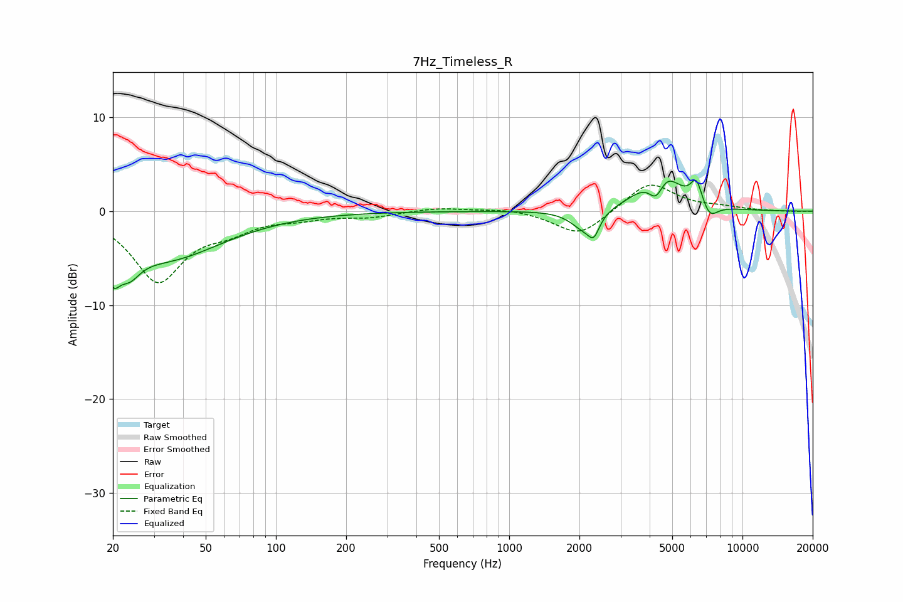

# 7Hz_Timeless_R
See [usage instructions](https://github.com/jaakkopasanen/AutoEq#usage) for more options and info.

### Parametric EQs
Apply preamp of -3.4 dB when using parametric equalizer.

|   # | Type    |   Fc (Hz) |    Q |   Gain (dB) |
|-----|---------|-----------|------|-------------|
|   1 | Peaking |        20 | 4.76 |        -3.3 |
|   2 | Peaking |        24 | 3.03 |        -2.4 |
|   3 | Peaking |        34 | 0.58 |        -4.9 |
|   4 | Peaking |      2071 | 2.57 |        -1.9 |
|   5 | Peaking |      2304 | 5.75 |        -2   |
|   6 | Peaking |      4270 | 4.01 |        -3   |
|   7 | Peaking |      4289 | 1.55 |         3.4 |
|   8 | Peaking |      4654 | 2.47 |         1.7 |
|   9 | Peaking |      6343 | 5.53 |         2.5 |
|  10 | Peaking |      7231 | 4.05 |        -1.6 |

### Fixed Band EQs
When using fixed band (also called graphic) equalizer, apply preamp of **-2.9 dB** (if available) and set gains manually with these parameters.

|   # | Type    |   Fc (Hz) |    Q |   Gain (dB) |
|-----|---------|-----------|------|-------------|
|   1 | Peaking |        31 | 1.41 |        -7.3 |
|   2 | Peaking |        62 | 1.41 |        -1.5 |
|   3 | Peaking |       125 | 1.41 |        -0.6 |
|   4 | Peaking |       250 | 1.41 |        -0.6 |
|   5 | Peaking |       500 | 1.41 |         0.4 |
|   6 | Peaking |      1000 | 1.41 |         0.3 |
|   7 | Peaking |      2000 | 1.41 |        -2.7 |
|   8 | Peaking |      4000 | 1.41 |         3.2 |
|   9 | Peaking |      8000 | 1.41 |         0.3 |
|  10 | Peaking |     16000 | 1.41 |        -0.1 |

### Graphs

