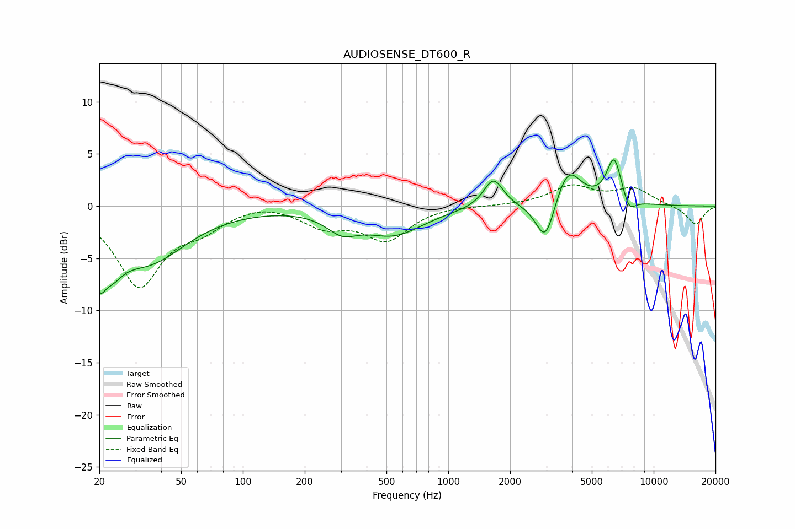

# AUDIOSENSE_DT600_R
See [usage instructions](https://github.com/jaakkopasanen/AutoEq#usage) for more options and info.

### Parametric EQs
Apply preamp of -4.5 dB when using parametric equalizer.

|   # | Type    |   Fc (Hz) |    Q |   Gain (dB) |
|-----|---------|-----------|------|-------------|
|   1 | Peaking |        20 | 5.04 |        -3.5 |
|   2 | Peaking |        23 | 2.59 |        -2.7 |
|   3 | Peaking |        34 | 0.75 |        -5.2 |
|   4 | Peaking |       304 | 1.85 |        -1.7 |
|   5 | Peaking |       541 | 0.97 |        -2.6 |
|   6 | Peaking |      1659 | 2.98 |         2.8 |
|   7 | Peaking |      2975 | 3.02 |        -4.3 |
|   8 | Peaking |      3817 | 2.17 |         3.8 |
|   9 | Peaking |      6422 | 3.65 |         4.4 |
|  10 | Peaking |      7578 | 4.26 |        -1.5 |

### Fixed Band EQs
When using fixed band (also called graphic) equalizer, apply preamp of **-2.1 dB** (if available) and set gains manually with these parameters.

|   # | Type    |   Fc (Hz) |    Q |   Gain (dB) |
|-----|---------|-----------|------|-------------|
|   1 | Peaking |        31 | 1.41 |        -7.5 |
|   2 | Peaking |        62 | 1.41 |        -1.7 |
|   3 | Peaking |       125 | 1.41 |         0.5 |
|   4 | Peaking |       250 | 1.41 |        -1.8 |
|   5 | Peaking |       500 | 1.41 |        -3.1 |
|   6 | Peaking |      1000 | 1.41 |         0.1 |
|   7 | Peaking |      2000 | 1.41 |         0   |
|   8 | Peaking |      4000 | 1.41 |         1.8 |
|   9 | Peaking |      8000 | 1.41 |         1.6 |
|  10 | Peaking |     16000 | 1.41 |        -1.8 |

### Graphs

