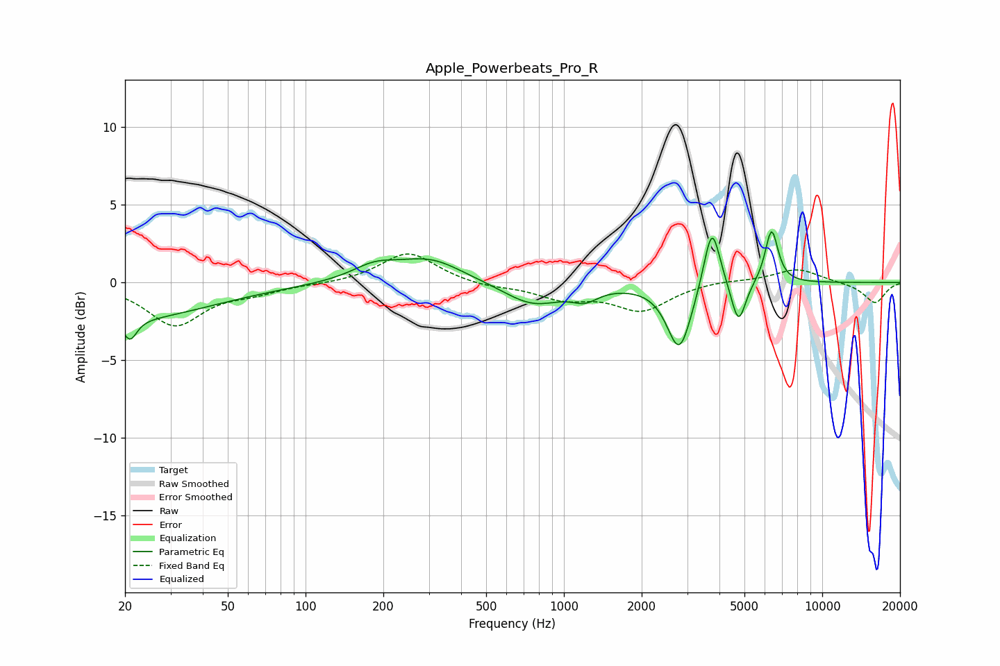

# Apple_Powerbeats_Pro_R
See [usage instructions](https://github.com/jaakkopasanen/AutoEq#usage) for more options and info.

### Parametric EQs
Apply preamp of -3.4 dB when using parametric equalizer.

|   # | Type    |   Fc (Hz) |    Q |   Gain (dB) |
|-----|---------|-----------|------|-------------|
|   1 | Peaking |        20 | 0.43 |        -2.3 |
|   2 | Peaking |        21 | 5.58 |        -1.3 |
|   3 | Peaking |       185 | 1.59 |         0.9 |
|   4 | Peaking |       304 | 1.1  |         1.5 |
|   5 | Peaking |       757 | 1.24 |        -1.5 |
|   6 | Peaking |      1208 | 2.83 |        -0.7 |
|   7 | Peaking |      2799 | 3    |        -4.4 |
|   8 | Peaking |      3741 | 4.47 |         4.2 |
|   9 | Peaking |      4739 | 5.03 |        -2.8 |
|  10 | Peaking |      6367 | 5.48 |         3.5 |

### Fixed Band EQs
When using fixed band (also called graphic) equalizer, apply preamp of **-1.9 dB** (if available) and set gains manually with these parameters.

|   # | Type    |   Fc (Hz) |    Q |   Gain (dB) |
|-----|---------|-----------|------|-------------|
|   1 | Peaking |        31 | 1.41 |        -2.7 |
|   2 | Peaking |        62 | 1.41 |        -0.5 |
|   3 | Peaking |       125 | 1.41 |        -0.1 |
|   4 | Peaking |       250 | 1.41 |         2   |
|   5 | Peaking |       500 | 1.41 |        -0.3 |
|   6 | Peaking |      1000 | 1.41 |        -0.9 |
|   7 | Peaking |      2000 | 1.41 |        -1.7 |
|   8 | Peaking |      4000 | 1.41 |         0.2 |
|   9 | Peaking |      8000 | 1.41 |         0.9 |
|  10 | Peaking |     16000 | 1.41 |        -1.3 |

### Graphs

