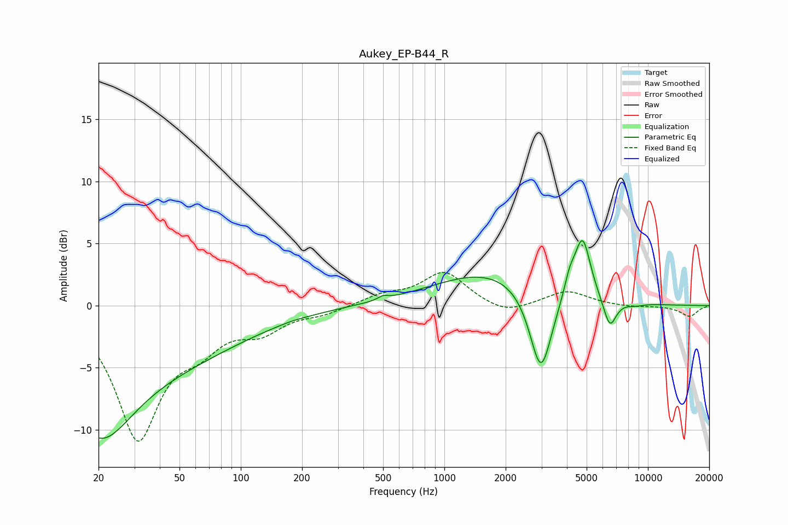

# Aukey_EP-B44_R
See [usage instructions](https://github.com/jaakkopasanen/AutoEq#usage) for more options and info.

### Parametric EQs
Apply preamp of -5.3 dB when using parametric equalizer.

|   # | Type    |   Fc (Hz) |    Q |   Gain (dB) |
|-----|---------|-----------|------|-------------|
|   1 | Peaking |        20 | 0.89 |        -6.9 |
|   2 | Peaking |        36 | 0.32 |        -4.3 |
|   3 | Peaking |       177 | 2.63 |         0.1 |
|   4 | Peaking |       500 | 5.99 |         0.3 |
|   5 | Peaking |      1701 | 0.51 |         2.8 |
|   6 | Peaking |      2981 | 2.56 |        -7   |
|   7 | Peaking |      4120 | 5.15 |         1.4 |
|   8 | Peaking |      4774 | 3.52 |         5   |
|   9 | Peaking |      6496 | 4.28 |        -2.4 |
|  10 | Peaking |      8659 | 3.01 |        -0.2 |

### Fixed Band EQs
When using fixed band (also called graphic) equalizer, apply preamp of **-2.8 dB** (if available) and set gains manually with these parameters.

|   # | Type    |   Fc (Hz) |    Q |   Gain (dB) |
|-----|---------|-----------|------|-------------|
|   1 | Peaking |        31 | 1.41 |       -10.4 |
|   2 | Peaking |        62 | 1.41 |        -2.3 |
|   3 | Peaking |       125 | 1.41 |        -1.7 |
|   4 | Peaking |       250 | 1.41 |        -0.5 |
|   5 | Peaking |       500 | 1.41 |         0.8 |
|   6 | Peaking |      1000 | 1.41 |         2.7 |
|   7 | Peaking |      2000 | 1.41 |        -0.8 |
|   8 | Peaking |      4000 | 1.41 |         1.2 |
|   9 | Peaking |      8000 | 1.41 |        -0.1 |
|  10 | Peaking |     16000 | 1.41 |        -0.9 |

### Graphs

