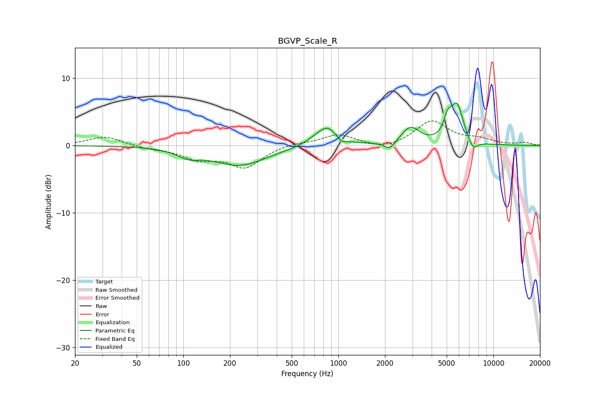

# BGVP_Scale_R
See [usage instructions](https://github.com/jaakkopasanen/AutoEq#usage) for more options and info.

### Parametric EQs
Apply preamp of -6.4 dB when using parametric equalizer.

|   # | Type    |   Fc (Hz) |    Q |   Gain (dB) |
|-----|---------|-----------|------|-------------|
|   1 | Peaking |       108 | 1.96 |        -1.1 |
|   2 | Peaking |       230 | 0.82 |        -2.9 |
|   3 | Peaking |       684 | 2.48 |         0.3 |
|   4 | Peaking |       853 | 2    |         3   |
|   5 | Peaking |      1040 | 4.01 |        -0.9 |
|   6 | Peaking |      2144 | 4.23 |        -1.2 |
|   7 | Peaking |      2920 | 2.46 |         2.5 |
|   8 | Peaking |      5061 | 6    |         2.2 |
|   9 | Peaking |      5812 | 3.2  |         5.9 |
|  10 | Peaking |      7364 | 4.17 |        -1.7 |

### Fixed Band EQs
When using fixed band (also called graphic) equalizer, apply preamp of **-3.8 dB** (if available) and set gains manually with these parameters.

|   # | Type    |   Fc (Hz) |    Q |   Gain (dB) |
|-----|---------|-----------|------|-------------|
|   1 | Peaking |        31 | 1.41 |         1.4 |
|   2 | Peaking |        62 | 1.41 |        -0.4 |
|   3 | Peaking |       125 | 1.41 |        -1.8 |
|   4 | Peaking |       250 | 1.41 |        -3.1 |
|   5 | Peaking |       500 | 1.41 |         0.4 |
|   6 | Peaking |      1000 | 1.41 |         1.6 |
|   7 | Peaking |      2000 | 1.41 |        -0.7 |
|   8 | Peaking |      4000 | 1.41 |         3.6 |
|   9 | Peaking |      8000 | 1.41 |         0.8 |
|  10 | Peaking |     16000 | 1.41 |         0.4 |

### Graphs

