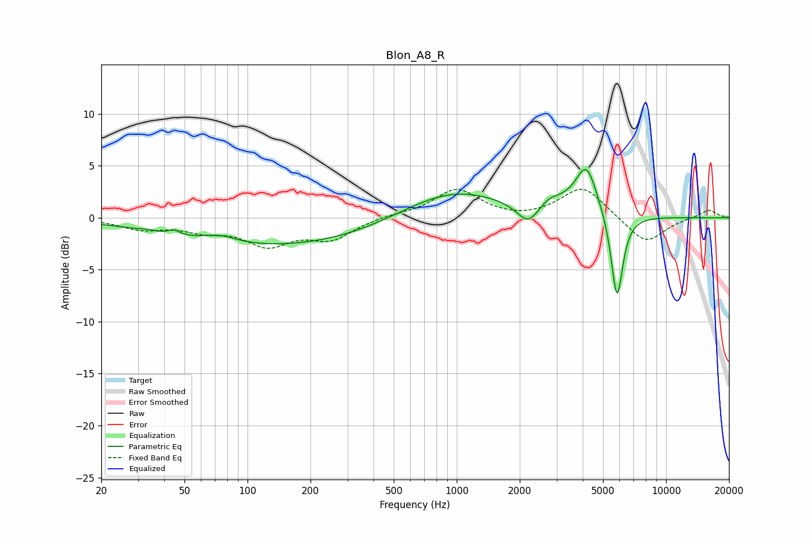

# Blon_A8_R
See [usage instructions](https://github.com/jaakkopasanen/AutoEq#usage) for more options and info.

### Parametric EQs
Apply preamp of -4.7 dB when using parametric equalizer.

|   # | Type    |   Fc (Hz) |    Q |   Gain (dB) |
|-----|---------|-----------|------|-------------|
|   1 | Peaking |        33 | 4.43 |         0.1 |
|   2 | Peaking |        45 | 5.7  |         0.5 |
|   3 | Peaking |        74 | 1.78 |         0.7 |
|   4 | Peaking |       139 | 0.26 |        -2.8 |
|   5 | Peaking |       942 | 0.56 |         2.9 |
|   6 | Peaking |      2188 | 2.72 |        -1.9 |
|   7 | Peaking |      2747 | 3.15 |         0.8 |
|   8 | Peaking |      3190 | 2.49 |         0.4 |
|   9 | Peaking |      4162 | 2.66 |         4.8 |
|  10 | Peaking |      5832 | 4.89 |        -8.5 |

### Fixed Band EQs
When using fixed band (also called graphic) equalizer, apply preamp of **-2.8 dB** (if available) and set gains manually with these parameters.

|   # | Type    |   Fc (Hz) |    Q |   Gain (dB) |
|-----|---------|-----------|------|-------------|
|   1 | Peaking |        31 | 1.41 |        -1   |
|   2 | Peaking |        62 | 1.41 |        -1   |
|   3 | Peaking |       125 | 1.41 |        -2.4 |
|   4 | Peaking |       250 | 1.41 |        -1.9 |
|   5 | Peaking |       500 | 1.41 |         0.2 |
|   6 | Peaking |      1000 | 1.41 |         2.7 |
|   7 | Peaking |      2000 | 1.41 |        -0.2 |
|   8 | Peaking |      4000 | 1.41 |         3   |
|   9 | Peaking |      8000 | 1.41 |        -2.6 |
|  10 | Peaking |     16000 | 1.41 |         0.8 |

### Graphs

