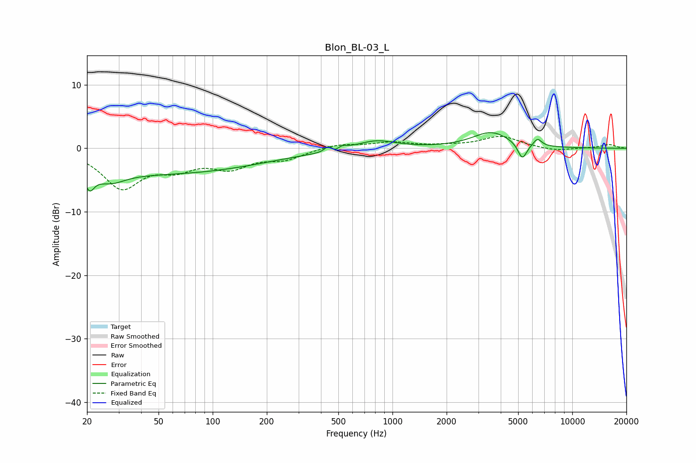

# Blon_BL-03_L
See [usage instructions](https://github.com/jaakkopasanen/AutoEq#usage) for more options and info.

### Parametric EQs
Apply preamp of -2.6 dB when using parametric equalizer.

|   # | Type    |   Fc (Hz) |    Q |   Gain (dB) |
|-----|---------|-----------|------|-------------|
|   1 | Peaking |        21 | 5.58 |        -2.6 |
|   2 | Peaking |        27 | 1.73 |        -1.8 |
|   3 | Peaking |        52 | 0.24 |        -3.9 |
|   4 | Peaking |       444 | 5.83 |         1.7 |
|   5 | Peaking |       464 | 3.89 |        -1.4 |
|   6 | Peaking |       521 | 4.74 |         0.8 |
|   7 | Peaking |       810 | 1.32 |         1.4 |
|   8 | Peaking |      3543 | 1.34 |         2.5 |
|   9 | Peaking |      5275 | 5.55 |        -2.6 |
|  10 | Peaking |      6407 | 6    |         1.2 |

### Fixed Band EQs
When using fixed band (also called graphic) equalizer, apply preamp of **-2.0 dB** (if available) and set gains manually with these parameters.

|   # | Type    |   Fc (Hz) |    Q |   Gain (dB) |
|-----|---------|-----------|------|-------------|
|   1 | Peaking |        31 | 1.41 |        -6   |
|   2 | Peaking |        62 | 1.41 |        -2.5 |
|   3 | Peaking |       125 | 1.41 |        -2.7 |
|   4 | Peaking |       250 | 1.41 |        -1.5 |
|   5 | Peaking |       500 | 1.41 |         0.7 |
|   6 | Peaking |      1000 | 1.41 |         0.9 |
|   7 | Peaking |      2000 | 1.41 |         0.3 |
|   8 | Peaking |      4000 | 1.41 |         1.9 |
|   9 | Peaking |      8000 | 1.41 |        -0.5 |
|  10 | Peaking |     16000 | 1.41 |         0.6 |

### Graphs

