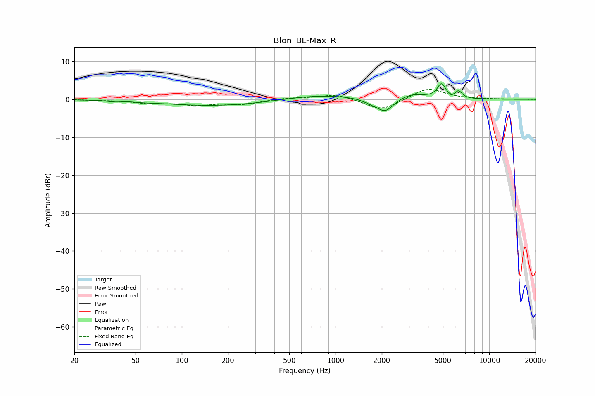

# Blon_BL-Max_R
See [usage instructions](https://github.com/jaakkopasanen/AutoEq#usage) for more options and info.

### Parametric EQs
Apply preamp of -4.2 dB when using parametric equalizer.

|   # | Type    |   Fc (Hz) |    Q |   Gain (dB) |
|-----|---------|-----------|------|-------------|
|   1 | Peaking |        34 | 5.89 |        -0.2 |
|   2 | Peaking |        56 | 2.42 |        -0.1 |
|   3 | Peaking |       177 | 0.37 |        -1.8 |
|   4 | Peaking |       770 | 0.55 |         1.4 |
|   5 | Peaking |      1762 | 2.17 |        -1.1 |
|   6 | Peaking |      2122 | 2.72 |        -3.2 |
|   7 | Peaking |      3158 | 1.7  |         1.4 |
|   8 | Peaking |      4894 | 5.13 |         3.8 |
|   9 | Peaking |      5702 | 4.87 |        -0.5 |
|  10 | Peaking |      6312 | 6    |         1.9 |

### Fixed Band EQs
When using fixed band (also called graphic) equalizer, apply preamp of **-2.7 dB** (if available) and set gains manually with these parameters.

|   # | Type    |   Fc (Hz) |    Q |   Gain (dB) |
|-----|---------|-----------|------|-------------|
|   1 | Peaking |        31 | 1.41 |        -0.2 |
|   2 | Peaking |        62 | 1.41 |        -0.9 |
|   3 | Peaking |       125 | 1.41 |        -1.3 |
|   4 | Peaking |       250 | 1.41 |        -1.2 |
|   5 | Peaking |       500 | 1.41 |         0.4 |
|   6 | Peaking |      1000 | 1.41 |         1.4 |
|   7 | Peaking |      2000 | 1.41 |        -3.1 |
|   8 | Peaking |      4000 | 1.41 |         3.1 |
|   9 | Peaking |      8000 | 1.41 |         0   |
|  10 | Peaking |     16000 | 1.41 |         0.1 |

### Graphs

