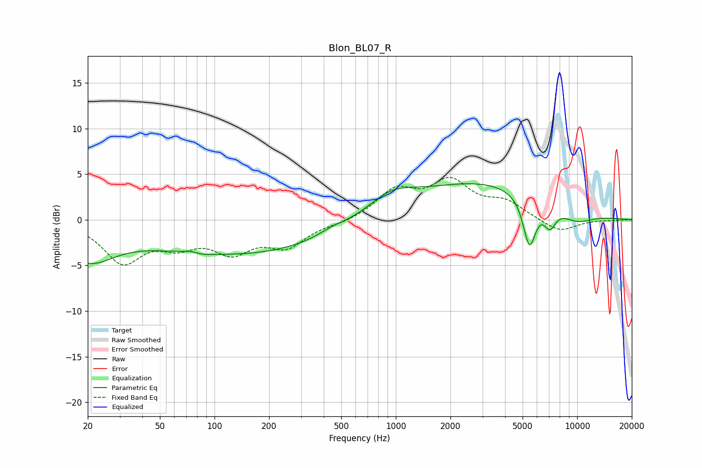

# Blon_BL07_R
See [usage instructions](https://github.com/jaakkopasanen/AutoEq#usage) for more options and info.

### Parametric EQs
Apply preamp of -4.0 dB when using parametric equalizer.

|   # | Type    |   Fc (Hz) |    Q |   Gain (dB) |
|-----|---------|-----------|------|-------------|
|   1 | Peaking |        20 | 0.97 |        -3.9 |
|   2 | Peaking |        76 | 3.02 |         0.4 |
|   3 | Peaking |        82 | 2.76 |        -0.4 |
|   4 | Peaking |       140 | 0.26 |        -3.8 |
|   5 | Peaking |       448 | 1.73 |         0.5 |
|   6 | Peaking |       935 | 1.07 |         2.2 |
|   7 | Peaking |      3040 | 0.35 |         4.1 |
|   8 | Peaking |      5453 | 3.91 |        -5.5 |
|   9 | Peaking |      7064 | 4.09 |        -2.2 |
|  10 | Peaking |      9860 | 1.27 |        -1.4 |

### Fixed Band EQs
When using fixed band (also called graphic) equalizer, apply preamp of **-4.7 dB** (if available) and set gains manually with these parameters.

|   # | Type    |   Fc (Hz) |    Q |   Gain (dB) |
|-----|---------|-----------|------|-------------|
|   1 | Peaking |        31 | 1.41 |        -4.4 |
|   2 | Peaking |        62 | 1.41 |        -2.2 |
|   3 | Peaking |       125 | 1.41 |        -3.1 |
|   4 | Peaking |       250 | 1.41 |        -2.7 |
|   5 | Peaking |       500 | 1.41 |        -0.4 |
|   6 | Peaking |      1000 | 1.41 |         3.1 |
|   7 | Peaking |      2000 | 1.41 |         3.9 |
|   8 | Peaking |      4000 | 1.41 |         1.7 |
|   9 | Peaking |      8000 | 1.41 |        -1.4 |
|  10 | Peaking |     16000 | 1.41 |        -0   |

### Graphs

