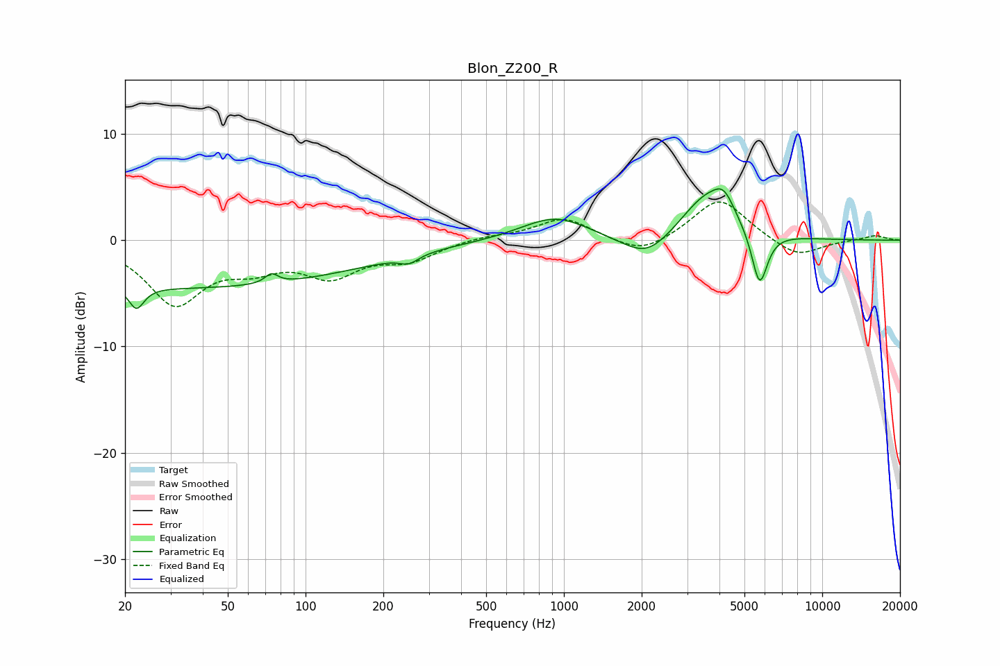

# Blon_Z200_R
See [usage instructions](https://github.com/jaakkopasanen/AutoEq#usage) for more options and info.

### Parametric EQs
Apply preamp of -4.9 dB when using parametric equalizer.

|   # | Type    |   Fc (Hz) |    Q |   Gain (dB) |
|-----|---------|-----------|------|-------------|
|   1 | Peaking |        22 | 4.97 |        -2.1 |
|   2 | Peaking |        34 | 0.18 |        -4.5 |
|   3 | Peaking |        74 | 5.82 |         0.9 |
|   4 | Peaking |       251 | 3.94 |        -0.7 |
|   5 | Peaking |       924 | 1.07 |         2.3 |
|   6 | Peaking |      1809 | 2.06 |         0.2 |
|   7 | Peaking |      2073 | 1.44 |        -2.5 |
|   8 | Peaking |      3575 | 1.36 |         4.3 |
|   9 | Peaking |      4166 | 3.44 |         1.9 |
|  10 | Peaking |      5721 | 4.48 |        -5.3 |

### Fixed Band EQs
When using fixed band (also called graphic) equalizer, apply preamp of **-3.7 dB** (if available) and set gains manually with these parameters.

|   # | Type    |   Fc (Hz) |    Q |   Gain (dB) |
|-----|---------|-----------|------|-------------|
|   1 | Peaking |        31 | 1.41 |        -5.8 |
|   2 | Peaking |        62 | 1.41 |        -1.9 |
|   3 | Peaking |       125 | 1.41 |        -3   |
|   4 | Peaking |       250 | 1.41 |        -1.7 |
|   5 | Peaking |       500 | 1.41 |         0.4 |
|   6 | Peaking |      1000 | 1.41 |         2.1 |
|   7 | Peaking |      2000 | 1.41 |        -1.5 |
|   8 | Peaking |      4000 | 1.41 |         4   |
|   9 | Peaking |      8000 | 1.41 |        -1.7 |
|  10 | Peaking |     16000 | 1.41 |         0.5 |

### Graphs

