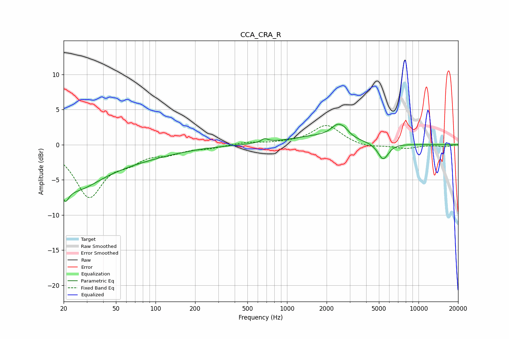

# CCA_CRA_R
See [usage instructions](https://github.com/jaakkopasanen/AutoEq#usage) for more options and info.

### Parametric EQs
Apply preamp of -3.0 dB when using parametric equalizer.

|   # | Type    |   Fc (Hz) |    Q |   Gain (dB) |
|-----|---------|-----------|------|-------------|
|   1 | Peaking |        21 | 5.42 |        -2.1 |
|   2 | Peaking |        24 | 0.75 |        -4.3 |
|   3 | Peaking |        41 | 0.31 |        -2.2 |
|   4 | Peaking |       674 | 5.45 |        -0.6 |
|   5 | Peaking |       675 | 5.51 |         1.2 |
|   6 | Peaking |      1760 | 0.61 |         1.1 |
|   7 | Peaking |      2412 | 2.85 |         1.5 |
|   8 | Peaking |      2725 | 3.56 |         0.7 |
|   9 | Peaking |      5347 | 3.55 |        -2.2 |
|  10 | Peaking |      5777 | 4.68 |        -0.2 |

### Fixed Band EQs
When using fixed band (also called graphic) equalizer, apply preamp of **-2.8 dB** (if available) and set gains manually with these parameters.

|   # | Type    |   Fc (Hz) |    Q |   Gain (dB) |
|-----|---------|-----------|------|-------------|
|   1 | Peaking |        31 | 1.41 |        -7.2 |
|   2 | Peaking |        62 | 1.41 |        -1.7 |
|   3 | Peaking |       125 | 1.41 |        -1   |
|   4 | Peaking |       250 | 1.41 |        -0.4 |
|   5 | Peaking |       500 | 1.41 |         0.3 |
|   6 | Peaking |      1000 | 1.41 |         0.2 |
|   7 | Peaking |      2000 | 1.41 |         2.8 |
|   8 | Peaking |      4000 | 1.41 |        -0.5 |
|   9 | Peaking |      8000 | 1.41 |        -0.5 |
|  10 | Peaking |     16000 | 1.41 |        -0.3 |

### Graphs

